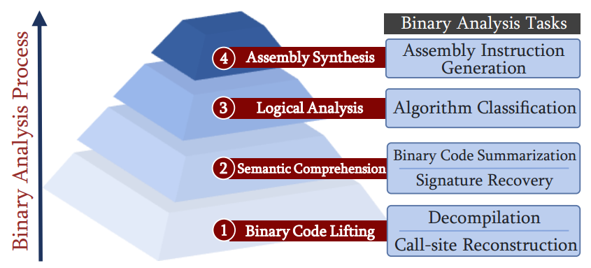
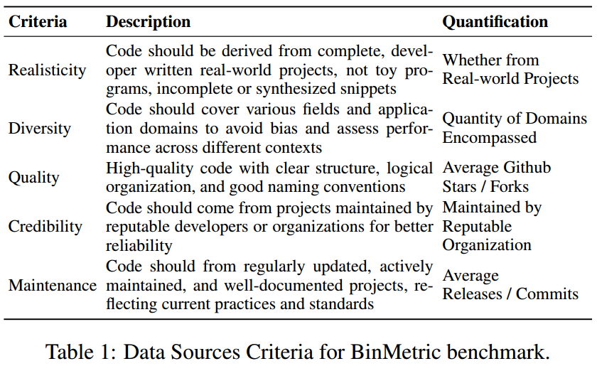
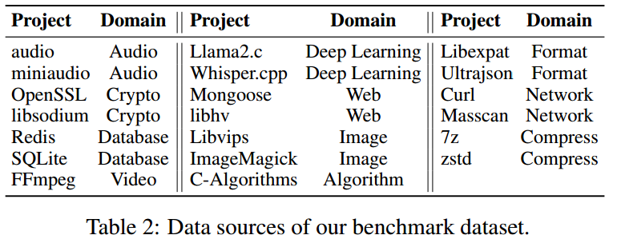
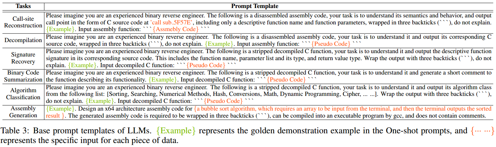
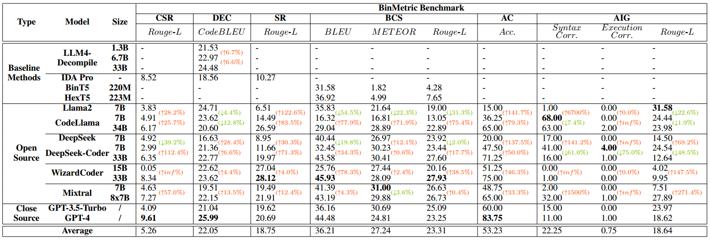
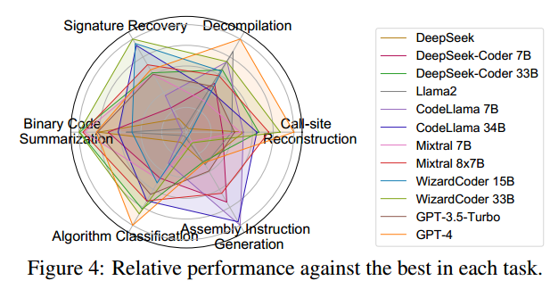
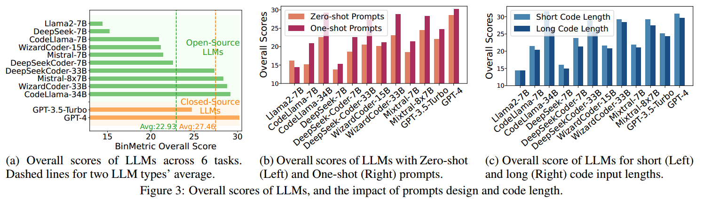

# BinMetric：大型语言模型的综合二进制代码分析基准

发表会议：IJCAI-25——第三十四届人工智能国际联合会议

作者：Xiuwei Shang1, Guoqiang Chen3, Shaoyin Cheng1,2∗, Benlong Wu1, Li Hu1,Gangyang Li1, Weiming Zhang1,2, Nenghai Yu1,2

团队：中国科学技术大学；安徽省数字安全重点实验室；奇安信技术研究院

# 背景

BinMetric 包含来自 20 个真实开源项目的 1000 个问题，涉及 6 个实用的二进制分析任务，包括反编译、代码摘要等，反映了实际的逆向工程场景。这是第一个综合基准测试，专门用于评估LLM在二进制分析任务上的性能。

指令架构和操作系统的多样性，加上闭源代码和文档的主导地位，限制了源代码分析在保护物联网设备固件方面的适用性，从而推动了二进制分析技术的进一步更新。

“像 ChatGPT 和 CodeLlama 这样的 LLM 能否有效地执行二进制分析任务？” 然而，LLM在这一敏感领域的具体应用仍处于起步阶段，某种程度上是由于缺乏能够充分衡量和推动该领域进展的专门基准框架。

由六个不同的任务组成，反映了现实世界的二进制分析挑战，包括调用站点重建、反编译、签名恢复、二进制代码摘要、算法分类和汇编指令生成。

为了从不同维度评估这些任务，构建了 4 个评估器并将它们集成到自动化管道中，以便轻松一键调用。

研究问题：

- RQ1：LLM在二进制分析方面的总体效果如何？
- RQ2：我们调查的哪个LLM表现最好？哪种类型的LLM表现更好？
- RQ3：哪些因素影响LLM的有效性？

# 问题定义

给定源代码S，它经过编译和剥离过程产生二进制文件B，表示为B = R(C(S))，其中C是编译器，R表示符号信息的剥离过程。

二进制代码分析器A，旨在支持一系列二进制分析任务T = {t1，t2，. 。 。 , tn}，以二进制文件 B 作为输入，并应用这些任务来生成相应的输出，形式化为：O = A(B) = {o1, o2, . . . , on}. 其中每个 oi 对应于每个任务 ti 的输出。

在本文中，我们将LLM视为二进制代码分析器A，评估其执行准确分析的能力，确保对原始源代码S的高保真度和可理解性，并展示其在二进制分析场景中的有效性。

# 挑战

1. 缺乏可靠的数据源和标准化的预处理。二进制文件的来源和质量影响基准的有效性，但不存在用于数据收集或预处理的标准化框架，例如编译环境设置、反编译工具选择和真实性识别。缺乏一致性，加上LLM的黑箱性质，使比较变得复杂，并且存在训练集中数据泄漏的风险，从而损害了可信度。
2. 二进制分析中的多样化任务。现有的工作侧重于孤立的任务，例如反编译 [Tan et al, 2024a] 或摘要 [Jin et al, 2023]。然而，二进制分析本质上是一个复杂的、多方面的过程，需要提取和理解各种信息类型和依赖性。仅限于单个任务的基准无法捕获有效分析所需的综合功能，并且不能代表现实世界的应用程序。
3. 现实场景的复杂性。基准测试应避免过度简化现实世界的二进制分析，例如依赖于狭窄的数据范围，而不能反映实践中遇到的各种项目类型和上下文。

针对这些挑战，提出以下解决方案：

1. 建立数据收集和预处理标准。提高二进制分析基准的质量需要严格的数据收集和预处理标准。受相关工作和遵循标准的启发，我们主张数据源应涵盖5个维度：**真实性、多样性、质量、可信性和可维护性**。我们强调标准化的预处理过程，这需要定义编译、反编译、元数据提取、地面实况识别、数据过滤和泄漏检查的协议，最大限度地减少偏差以提高可靠性。

2. 启用多方面的任务评估。为了真正衡量LLM在二进制分析中的表现，基准测试应该评估整个分析生命周期中一系列相互关联的任务。如图所示，我们的基准测试**由反编译、函数签名恢复、汇编指令生成等四个维度的六个任务组成**，以综合评价LLM的能力。

   
   基准测试中的二进制分析任务

3. 模拟现实世界的复杂性。在本文中，我们的目标是复制现实世界二进制分析场景的复杂挑战。为了实现这一目标，我们结合了来自不同项目领域的数据，以确保广泛的覆盖范围并捕获各种现实环境。随后，我们剖析了逆向工程师在实际二进制分析工作中面临的复杂挑战，从而制定了一系列评估任务来反映现实世界分析的复杂性。

# BinMetric

BinMetric基准测试总体框架

## 二进制分析任务

BinMetric包含四个维度的六个具有代表性的二进制分析任务，反映了人类逆向工程师所面临的挑战，LLM也面临着类似的障碍。

1. ### 调用点重构（CSR）

   函数调用关系揭示了程序模块之间的控制流和依赖关系。

    CSR 在逆向工程中至关重要，可以从提供的汇编代码中识别和重构函数调用，包括函数名称及其调用参数。

   它将**汇编代码和指定的调用位置作为输入，生成调用的高级源代码表示**。

   评估侧重于**文本一致性**，确保恢复的调用站点与原始代码的意图和结构相匹配。

2. ### 反编译（DEC）

   反编译对于直观、深入地理解二进制程序至关重要，其目的是基于汇编代码重建人类可读的高级编程语言表示形式，例如 C 或 C++。

   **输入是具有函数粒度的汇编代码，输出是相应的源代码**。

   该任务使用 **CodeBLEU** [Ren et al, 2020] 进行评估，它通过将反编译代码与原始源代码进行比较来评估语法和语义的准确性。

3. ### 签名恢复（SR）：

   函数签名表示函数的接口，包括其名称、参数类型和名称以及返回类型，这对于理解程序行为至关重要[Jin et al, 2022]。

   在此任务中，**输入是从剥离的二进制文件中反编译的伪代码，输出是完整的函数签名**。

   **文本一致性**指标用于评估恢复的签名与原始源代码签名之间的匹配性。

4. ### 二进制代码摘要（BCS）

   代码摘要旨在生成二进制代码的简洁自然语言摘要，突出其核心功能和操作，而不需要检查复杂的细节[Xiong et al, 2023]。

   **输入是反编译后的伪代码，输出是对应的自然语言摘要**。

   评估使用**文本一致性**指标来确保预测在相关性和清晰度方面与事实相符。

5. ### 算法分类 （AC）

   此任务涉及对二进制代码中的算法模式进行识别和分类，揭示排序、加密等关键操作，这对于在安全分析过程中理解代码段的功能和用途至关重要。

   **输入是反编译后的伪代码，输出是其对应的算法类别标签**。

   评估是使用**准确性**来完成的。

6. ### 汇编指令生成（AIG）

   在没有源代码的情况下分析恶意软件和修复漏洞通常需要修改汇编代码，即汇编合成。

   AIG任务将**特定功能的自然语言描述作为输入，并生成相应的汇编指令**。

   为了评估生成的代码是否能够实现预期功能，我们评估**语法和执行的正确性**，并使用**文本一致性**来衡量可靠性。

## 数据收集和预处理

BinMetric 基准的数据源标准

这些标准以行业标准为依据，例如 NIST 的可信人工智能指南，以及软件生命周期和质量保证国际标准，例如 ISO/IEC 25010:2011 [标准化，2011] 和 IEEE Std-730-2014。许多LLM基准还强调现实性、多样性、质量和可信度等属性。

从 GitHub 精选了 **20 个高星级 C 语言项目**，确保了出色的代码质量、可信度和可维护性。这些项目平均有 18.48K Stars、3.9K Fork、75.8 Releases 和 15.5K Commits，涵盖音频、图像、Web、加密和网络等 11 个领域，保证了真正的编码实践和多样性。

基准数据集的数据源

### 数据预处理

1. 编译、剥离和反编译

   我们在 Ubuntu 22.04 操作系统上为 x86-64 架构编译选定的项目，包括 DWARF [International，2010] 调试信息，以确保详细的元数据可用于后续对齐。

   每个项目都使用其默认编译器设置，反映典型环境。

   我们使用 strip 命令删除所有符号信息，以模拟符号通常不可用的现实条件。

   然后我们用IDA Pro对剥离后的二进制文件进行反汇编和反编译，获得汇编指令和反编译的伪代码。

2. 源代码信息提取

   我们使用 srcML [Maletic and Collard, 2015] 解析源文件并提取关键信息，包括函数签名、实现、人工编写的摘要等。

   srcML 将源文件转换为 XML 格式，通过 XML 解析技术实现准确的提取和处理。

   然后存储提取的信息以供后续对齐。

3. 二进制源对齐

   我们使用 DWARF 调试信息来对齐源代码和二进制代码，该信息将二进制函数和变量链接到它们在源代码中的位置（文件名、行号和列号）。

   这使得汇编指令和反编译代码能够精确匹配到它们相应的源代码位置。

## 数据集构建

1. 数据构建

   为了避免过长的代码片段分析不完整以及非常短的代码片段缺乏上下文，我们应用**双阈值过滤**来删除太短或超出LLM上下文窗口的代码片段，确保评估的可行性。

   我们还确保我们的基准数据集不是LLM训练集的一部分。

   所有评估数据都是从**自编译的二进制文件中反汇编或反编译的代码，去除了符号信息**，大大降低了包含在训练集中的风险。

   为了进一步验证这一点，我们使用谷歌搜索引擎检查是否有任何代码在网上以纯文本形式出现。找到的任何精确的全字匹配都会被删除，从而提高数据集的可信度。

2. 提取并组装问题项

   经过预处理和过滤后，我们从二进制和源代码中获取高质量的**对齐元数据**来构造问题项。

对于 DEC 和 SR 任务，我们随机采样 **250 对伪代码**并从元数据中输出真实值。

对于 CSR，对 **70 个程序集片段**进行了采样，并手动注释了要恢复的调用站点位置及其基本事实。

对于 BCS 任务，我们最初考虑使用源文件中的人工编写注释作为标签，但只有不到 20% 的函数有注释，其中许多缺乏功能摘要并且包含嘈杂的内容。受到最近的作品 [Tan 等人，2024b] 的启发，这些作品**利用 ChatGPT 等 LLM 来以合理的可靠性执行数据注释任务**，我们转向 ChatGPT 来生成源代码的摘要。我们选择 250 个伪代码-摘要对，并手动检查其正确性，以确保 BCS 的高质量地面实况。

对于 AC 任务，我们从 C-Algorithms [C-Algorithms, 2024] 项目中采样了 80 个伪代码片段，并**手动注释**了各自的算法类别。

对于 AIG 任务，我们设计了 100 条清晰的指令来指导LLM按照**英特尔语法**生成针对给定功能的汇编代码片段，例如实现冒泡排序。我们还提供带有输入和输出的测试用例，以验证生成的汇编代码的功能正确性。

总体而言，上述任务需要人工注释、审核和验证，大约需要 60 个工时。

## 基本提示词模板

采用了一次性提示策略，并探讨了零样本性能。虽然零样本在简单任务上表现良好，但它通常缺乏足够的上下文来进行复杂的二进制分析，从而导致准确性和一致性较低。

思想链方法有助于逐步推理，但面临上下文长度限制、推理效率和不确定的性能改进等挑战。

LLM 的基本提示模板。 {Example}代表One-shot提示中的黄金演示示例，{······}代表每条数据的具体输入。

## 评估指标

构建了 4 个评估器，每个评估器都针对特定维度，并集成到自动化管道中以便于调用。

1. ### 二进制提升评估器。

   该评估器评估LLM将汇编形式的二进制代码转换为更高级别表示的能力，这对于重建二进制程序结构至关重要。

   它适用于 CSR 和 DEC 任务，评估指标为 **Rouge-L** [Lin, 2004] 和 **CodeBLEU** [Ren et al, 2020]。

   Rouge-L 测量生成的调用站点信息和参考调用站点信息之间的**文本一致性**，

   而 CodeBLEU 评估反编译代码与源代码的**语法和语义相似性**。

2. ### 语义理解评估器。

   该评估器衡量LLM对二进制代码的理解和解释，重点关注捕获代码片段背后的意图。

   它适用于 SR 和 BCS 任务，使用 **BLEU-1** [Papineni et al, 2002]、**METHOR** [Lavie and Denkowski, 2009] 和 **Rouge-L** 来评估精确的**单词匹配、语义灵活性和丰富性以及结构连贯性**。

3. ### 逻辑分析评估器。

   该评估器测试LLM理解二进制代码中的算法逻辑、对算法或模式进行分类的能力。

   它适用于AC任务，以准确度为指标。

4. ### 装配综合评估器。

   该评估器评估LLM根据 AIG 任务的自然语言描述生成准确、可执行汇编代码的能力。

# 实验

## 实验设置

- 大型语言模型设置

  我们根据以下标准评估了来自 5 个模型系列的 12 个LLM，包括本地可部署的开源模型和可 API 调用的闭源模型：

  1. 在 EvalPlus [EvalPlus，2024] 等排行榜上排名最先进的LLM。 
  2. 广泛的代码预训练，增强编程理解。
  3. 自然语言和代码生成任务的强大能力。 
  4. 经过指令调整，可有效遵循详细指令。

- 实施细节

  实验在配备 8 个 NVIDIA RTX A6000 GPU 的 Ubuntu 22.04 服务器上进行。

  对于闭源LLM，即ChatGPT和GPT4，我们调用OpenAI的API来访问gpt-3.5-turbo-16k-0613和gpt-4-0613后端模型。

  开源 LLM 是从 Huggingface 下载的，支持 FP16 的半精度推理。考虑到上下文窗口的限制，我们将最大长度设置为 8192，将最大新令牌设置为 2048。

  由于在大多数代码相关任务中准确性优先于多样性，因此采样温度设置为 0.1，top k 和 top p 均设置为 1 以实现确定性响应

- Baseline方法

  为了评估LLM的有效性，我们努力包含尽可能多的基线方法。

  - 对于静态分析工具 IDA Pro [Hex-RaysSA, 2024]，我们使用其 Hex-rays 反编译器来执行 CSR、DEC 和 SR 任务，尽管它不支持其他任务。
  - 对于 DEC 任务，我们评估了 LLM4Decompile [Tan 等人，2024a] 的三个版本（1.3B、6.7B 和 33B），LLM4Decompile 是在 DeepSeek-Coder 上针对反编译任务进行微调的 LLM。
  - 对于 BCS 任务，我们重现了 BinT5 [Al-Kaswan et al,2023] 和 HexT5 [Xiong et al,2023] 的方法。
  - 对于 AC 和 AIG 任务，没有可用的现有基线，我们的 BinMetric 为未来的研究提供了潜在的基线。

## 整体效能

LLM和 BinMetric 基线的总体有效性。 ↑和↓表示两行之间的相对增减。

### 二进制Lifting的结果

我们使用 Rouge-L 和 CodeBLEU 评估二进制提升，分别评估 CSR 和 DEC 中的 LLM 性能。平均分分别为5.26%和22.05%。对于一般的LLM来说，在没有关于被调用者本身的额外知识的情况下重建调用站点是非常具有挑战性的。尽管 GPT-4 获得了最高的 CSR 分数（9.61%），但手动检查显示有用的重建有限。除 GPT-4 外，所有LLM的得分均低于 IDA Pro 基线 (8.52%)，其中 WizardCoder-15B 由于未能遵循说明而得分最低 (0.05%)。相比之下，DEC 分数相对较高，表明LLM有潜力执行反汇编代码和源代码之间的语义映射。 GPT4 和 DeepSeek-7B 获得了最高和最低分数，分别为 25.99% 和 16.63%，这表明反编译对非定制模型提出了一致的挑战，并且没有表现出基于模型大小和域的显着性能变化。 LLM4Decompile 在相同规模上比其基本模型 DeepSeek-Coder 略有改进。

### 语义理解的结果

我们通过 SR 和 BCS 评估语义理解。对于这两个语义理解任务，LLM 的表现相对较好，大部分超过了基线方法。在SR中，Rouge-L的平均得分为18.75%，其中WizardCoder-33B得分最高（28.12%），而Llama2-7B则表现不佳（6.51%）。此外，性能随着模型大小的增加而提高（高达 42.8%），并且特定于代码的 LLM 比一般 LLM 的性能高出 76.45%。对于BCS，我们使用BLEU、METEOR和Rouge-L进行综合评估。 WizardCoder-33B 获得了最好的平均分数 (33.3%)，而 CodeLlama-7B 的表现最差 (22%)。有趣的是，与一般的 DeepSeek-7B 相比，DeepSeek-Coder-7B 的表现较差，得分为 28.71% vs. 30.44%，这表明特定于代码的预训练可能会阻碍自然语言表达。

### 逻辑分析的结果

 AC 任务评估LLM在给定候选列表中识别伪代码类的能力。 LLM的总体得分为53.23%，表明他们能够理解高层语义并在一定程度上支持更深层次的逻辑推理。 GPT4 以 83.75% 领先，而 Llama2-7B 和 DeepSeek-7B 等较小模型得分最低（15.00% 和 20.00%）。

代码特定的 LLM 比一般的 LLM 表现好 139.6%，较大的模型显示出显着的进步。

### Assembly Synthesis的结果

AIG 评估LLM使用英特尔语法从自然语言描述生成汇编代码的能力。只有可编译的输出才被认为是语法正确的。 CodeLlama-7B 获得了最高的语法正确性得分 (68%)，这可能是由于对汇编代码进行了额外的预训练。相比之下，其他模型则表现不佳，GPT-4 得分仅为 11%。通过测试用例评估执行正确性，平均通过率低于1%。我们还使用 Rouge-L 来衡量文本一致性。 Llama2-7B 获得了最高分（31.58%），手动识别揭示了其预测与参考之间更多相似的代码块。然而，WizardCoder-15B (4.02%) 和 Mixtral-7B (7.51%) 等模型无法遵循说明。这些结果表明，由于组装的复杂性和缺乏领域专业知识，LLM目前在重建低级操作方面遇到了困难。

## LLMs的对比&提示词设计&代码长度

每项任务中与最佳者的相对表现

总体而言，GPT-4 在 DEC、CR 和 AC 任务中表现出色，但在 AIG 中表现不佳

LLM的总体分数，以及提示设计和代码长度的影响

- 图 3 (a) 显示了所有模型跨任务的平均得分。与开源LLM (22.93%) 相比，闭源LLM的平均分数 (27.46%) 更高。然而，某些开源模型（例如 CodeLlama-34B）超过了闭源平均水平。这表明开源LLM在二进制分析方面具有竞争力，为基于这些模型开发二进制领域的专家LLM提供了强大的信心。

- 我们的研究检查了两个模型大小范围（7-15B 和 33-8x7B），并涉及具有来自多个 LLM 系列的代码领域知识的模型。如图 3 (a) 所示，较大的模型通常表现更好，这可能是由于改进的指令跟踪能力和更丰富的嵌入式知识。此外，即使代码数据集很少包含反编译的二进制代码，代码域内的特定领域知识也可以提高性能。

- 图 3 (b) 比较了使用零次提示和一次提示的性能。在大多数情况下，一次性提示显着提高了总体分数，平均提高了16.65%，强调了提供示例对指导LLM进行复杂领域二进制分析的重要性。然而，在一次性提示的情况下，Llama2-7B 的性能下降了 10.79%。分析表明，它倾向于复制提供的示例，而不是生成基于上下文的响应，这可能是由于其固有的能力限制影响了其从演示中进行概括的能力。
- 图 3 (c) 显示，与较短的代码片段相比，较长的代码片段会导致平均分数下降 6.00%。这种跨任务一致的趋势凸显了处理扩展代码片段的挑战。

# 讨论

- GPT-4和WizardCoder34B在算法分类和二进制代码摘要方面表现出色，展示了它们提取高级语义和支持逻辑推理的能力。

  然而，由于汇编指令的复杂性和有限的领域知识，LLM在调用点重建和汇编生成方面面临挑战。

  虽然LLM展现出希望，但挑战仍然存在，未来的工作应该解决这些差距。

- 基础LLM和特定领域模型的进步使得二进制专家LLM既可行又前景光明。

  与源代码模型一样，二进制特定的LLM应该涵盖整个二进制分析生命周期的不同任务。

  作为多任务基准排行榜，BinMetric 对于评估和指导该领域的进展至关重要。

  二进制专家LLM应该在预训练过程中融入广泛的二进制领域知识，包括各种汇编语言、编译器优化、指令集架构等，从而能够更深入地掌握代码语义和结构。

  **检索增强生成和专门指令微调**等技术可以扩展LLM的二进制知识。我们的研究表明不同的LLM在特定领域表现出色，这表明结合他们的优势来创建用于二进制分析的专家集成模型的潜力

