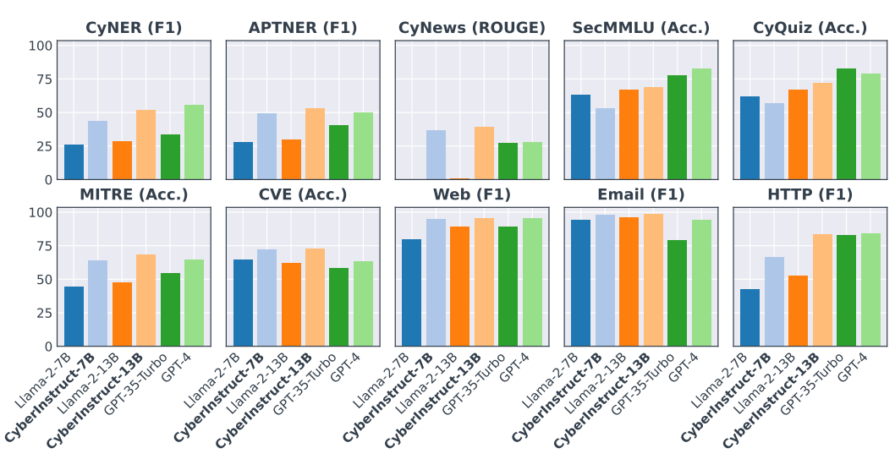
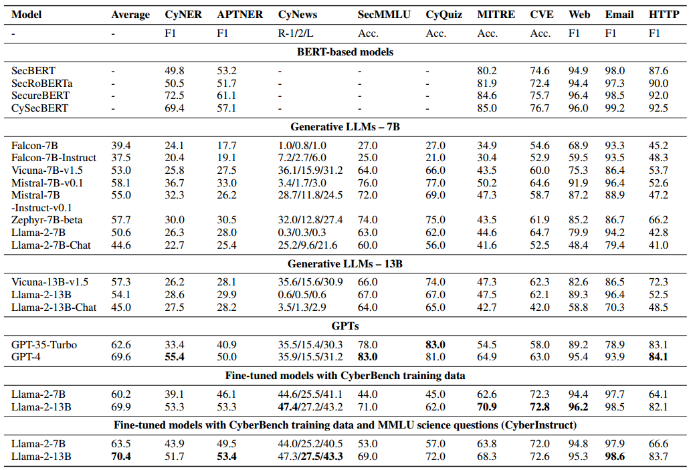

# CyberBench：用于评估网络安全中LLM的多任务基准

CyberBench 是一个多任务基准，用于评估LLM在与网络安全相关的 NLP 工作中的表现

CyberInstruct 是一系列基于最先进的开放式 LLM 的微调生成式 LLM，其中利用 CyberBench 的训练语料库来创建在网络安全领域具有增强功能的专用模型。

来自 CyberBench 的基线（Llama-2-7B、Llama-2-13B、GPT-35-Turbo 和 GPT-4）和微调模型（CyberInstruct-7B 和 CyberInstruct-13B）与 10 个任务的评估结果，其中 all-mpnet-base-v2 嵌入模型除了零样本设置的摘要任务外还用于检索五样本相似示例。 CyNER和APTNER是命名实体识别（NER）任务，CyNews是摘要任务，SecMMLU和CyQuiz是多项选择任务，其余数据集是文本分类任务。 F1、ROUGE 和准确度 (Acc.) 分数用作不同任务的评估指标。

## CyberBench

来自四个任务的十个数据集作为基准：命名实体识别（NER）、摘要（SUM）、多项选择（MC）和文本分类（TC）

- 命名实体识别在网络安全领域至关重要，因为它可以从非结构化文本数据中提取威胁行为者、漏洞和攻击方法等关键信息。
- 总结可帮助网络安全专业人员将冗长的网络安全报告或文章压缩为简洁且相关的信息，从而使安全分析师能够更快、更高效地做出决策。
- 多项选择任务测试模型从给定信息中推理和得出逻辑结论的能力，这是处理复杂网络安全事件时的一项重要技能。
- 文本分类对于组织和分类网络安全领域中生成的大量文本数据至关重要，这反过来又有助于高效的信息检索和分析。

### 任务和数据集

#### 命名实体识别（NER）

##### CyNER

该数据集是手动提取、清理并注释了 5 个实体：恶意软件、指标、系统、组织和漏洞。该数据集已根据文档分为训练集、验证集和测试集。在预处理过程中，我们将段落分成句子并删除单标记句子。我们还修复了标签问题并在数据清理期间删除重复项。数据集的BIOtags已转换为JSON格式：“实体类型”：[“实体1”，“实体2”，...]，可以由生成LLM方便地处理。

##### APTNER

该数据集包含 21 个实体，从威胁参与者、安全团队到 URL、域和哈希值，并由经过培训的学生手动注释并由专业人员验证。作者将数据分为 7:1.5:1.5。在预处理过程中，我们将段落拆分为句子，并将单标记句子删除为 CyNER。我们还通过启发式规则修复标签问题并删除重复项。与 CyNER 类似，输出被格式化为 JSON 文本。

#### 文本摘要（SUM）

##### 网络安全新闻文章数据集（CyNews）

包含来自 Hacker News® 的网络安全新闻。原始数据将新闻文章分为几种类型的网络威胁。在我们的基准测试中，我们使用新闻文章作为模型输入，标题作为模型输出，将其转换为摘要任务

#### 多项选择

##### MMLU 计算机安全 (SecMMLU)

除了包含 5 个用于少样本设置的示例的开发集外，该数据集没有针对计算机安全问题的训练集。

这要求模型在预训练期间应该已经学习了领域知识，而不是从 MMLU 少样本示例或训练集中学习该知识。

##### 网络安全技能评估 (CyQuiz)

这些练习题可用于评估考生对网络安全领域的一般知识的能力。在这个基准测试中，我们只保留有 4 个选项和一个正确答案的多项选择题。作为MMLU的设置，我们在训练集中保留5个示例，在测试集中保留100个示例，并将其他示例放在验证集中。

#### 文本分类（TC）

##### MITRE ATT&CK®

句子标签对是从该框架中每种技术的过程示例中提取的，其中输入是一个过程示例的描述，输出是技术 ID 和名称。这里的过程是技术或子技术的具体实现。在预处理过程中，我们删除了具有多个标签和技术且示例少于 10 个的句子。

##### CVE® 和 CWE™ 映射数据集

漏洞描述用作文本输入，严重性级别（严重、高、中、低）用作标签。由于数据量较大，我们只保留 2021 年以来的 CVE。我们还删除了重复项和超过 2,000 个字符的长输入。

##### 网页网络钓鱼检测

一个包含 URL 和提取特征的数据集，用于构建网络钓鱼检测系统并对其进行基准测试。这些特征是从 URL 和网页内容中提取的。该数据集一半是合法 URL，一半是网络钓鱼 URL。在 CyberBench 中，我们仅使用 URL，而不使用额外的特征来进行 URL 分类任务。

##### 网络钓鱼电子邮件检测（电子邮件）

提供了用于检测带有电子邮件文本的网络钓鱼电子邮件的数据集。该数据集包含 61% 的安全电子邮件和 39% 的网络钓鱼电子邮件。在预处理过程中，我们会丢弃超过 2,000 个字符的长电子邮件。

##### HTTP 数据集 CSIC 2010 (HTTP)

包含自动生成并针对电子商务 Web 应用程序的 Web 请求的数据集。该数据集是为评估网络攻击防护系统而开发的。每个HTTP请求可以有多个字段，包括方法、用户代理、缓存控制等。异常类包括三种类型的恶意请求：静态攻击、动态攻击和无意的非法请求。由于数据量巨大，我们仅使用正常类和异常类原始测试集的 20% 来获得平衡数据集。

### 说明和Prompts

GPT-4 不是为一个数据集生成一条人工指令，而是为每个数据集生成 10 条不同的指令，并随机分配给示例。这种设计可以增加基准测试的鲁棒性，并避免引入对单指令的过多依赖。

对于命名实体识别 (NER) 任务，指令包括实体类型、实体定义和所需的输出格式。对于文本分类任务，指令指定输入文本类型和输出类别。

在实验过程中，每个示例的指令、输入和输出都被格式化为单个提示，作为 Alpaca (Taori et al 2023) 指令调整数据集。

为了增强模型性能并鼓励生成指定格式的输出，我们采用了**带有检索增强生成（RAG）的小样本提示方法**，

其中使用**基于相似性搜索的示例选择器**从训练集中选择示例。在选择器内部，使用嵌入模型将示例嵌入到向量中，并计算给定测试示例和训练示例之间的相似度分数。过利用向量存储中的最近邻搜索来选择相似度得分最高的示例

### 评估指标

1. 对于命名实体识别 (NER) 任务，可以为所有实体类型生成实体。因此，通过计算所有实体类型来采用**微平均 F1 分数**。
2. 在摘要任务中，使用**面向回忆的 Gisting 评估**（ROUGE）（Lin 2004）分数，包括 ROUGE-1、ROUGE-2 和 ROUGE-L，其中 ROUGE-1 计算预测和参考之间一元组的重叠，ROUGE-2 计算二元组，而 ROUGE-L 是基于最长公共子串（LCS）计算的。
3. 对于多项选择任务，准确性作为衡量标准。
4. 对于文本分类任务，准确性适用于多类任务（多于两个类），而正类（例如网络钓鱼或异常）的 F1 分数用于二元分类任务。

为了计算十个数据集的平均分数，采用了一种简单的平均方法。

但是，对于摘要任务，首先计算 ROUGE-1、ROUGE-2 和 ROUGE-L 分数的平均值，然后再得出总体平均值。这种方法可确保对各种任务和数据集的法学硕士表现进行全面评估。

## CyberInstruct

基础模型——Llama-2

### 指令调优（Instruction Tuning）

利用 CyberBench 的训练数据集创建一个在网络安全领域具有增强功能的专用模型。

在微调过程中**将显式指令合并到模型的输入中**，从而指导模型为网络安全任务生成更准确和相关的输出。

仅为 CyberBench 中的所有任务微调单个模型。在那里，CyberInstruct 可以同时处理多任务，而无需为每个任务进行额外的微调或单独的模型。

在准备评估任务时，我们将所有示例格式化为指令、输入和输出，并使用 Alpaca 将它们组合成文本提示模板

我们在这里只使用零样本提示模板，没有少数样本示例。对于与指令配对的每个输入，输出也包含在文本中，以教导模型如何正确处理输入。

### 参数高效微调（PEFT）

采用了一种称为 QLoRA（量化低阶适应）的方法，其中梯度通过冻结的 4 位量化预训练层进行反向传播，并在选定的注意力模块之上应用可训练的低阶适配器。

## 实验

### 基线：

来自自然语言处理 (NLP) 和网络安全领域的两组著名模型：

1. 第一组由基于 BERT 的模型组成，这些模型专门针对网络安全领域进行了预训练
2. 第二组则包含各种大型语言模型 (LLM)，展示了一系列架构和功能

在使用生成式 LLM 进行实验时，温度设置为 0。为了减少文本生成时间和成本，我们在第一条输出行末尾截断了模型响应，这在设计上适用于 CyberBench 中的所有任务。然后检查模型响应是否匹配正确的输出，并随后计算评估指标。

基于 BERT 的模型针对每项任务进行了微调。

基础模型还使用 CyberBench 语料库进行了微调，以生成 CyberInstruct。

除了生成LLM的常规设置外，每个任务还应用特定设置。

- 对于 NER，我们消除每个实体类型中的重复实体，并检查该类型中的匹配实体。累积所有实体类型中的匹配实体以计算微观 F1 分数。
- 对于多项选择和文本分类任务，我们检查生成的输出是否能够与真实输出完全匹配，尽管可以在未来的研究中实现模糊匹配。

### 基线实验结果

CyberBench 上基线和微调模型的评估结果，其中 all-mpnet-base-v2 嵌入模型除了摘要任务外还用于检索法学硕士的五次相似示例。根据模型架构和参数数量，基线分为三组。使用两种训练数据，一种来自 CyberBench 训练集，另一种来自初中科学问题的 MMLU 训练数据。在评估指标中，“R”是 ROUGE 分数，“Acc”是 ROUGE 分数。是准确度。

基于 BERT 的模型需要对每个任务进行微调，而生成式 LLM 可以执行多个任务而无需微调。

- 就整体性能而言，GPT-4 在此基准测试中优于所有其他 LLM，而 GPT-3.5 紧随其后，Mistral-7B 和 Zephyr7B 紧随其后。
- 对于 NER 任务，基于 BERT 的模型优于大多数生成式 LLM，而 GPT-4 可以实现与 SecBERT 和 SecRoBERTa 相当的性能。
- 对于摘要任务，GPT-4 和 Vicuna-7B 得分最高，但大约紧随其后的是 GPT-3.5 和 Vicuna-13B。
- 对于多项选择任务，GPT-4 在 SecMMLU 数据集上名列前茅，而 GPT-3.5 在 CyQuiz 数据集上表现出色。
- 对于五个文本分类任务，基于 BERT 的模型比生成式 LLM 取得了更好的性能。

在生成模型中，GPT-4 在 MITRE、Web 和 HTTP 数据集上获得最高分数。 Llama-2-7B 和 Mistral-7B 在 CVE 任务中表现良好，Llama2-13B 和 Mistral-7B 是电子邮件数据集的最佳模型。

### 微调大模型实验结果

微调 Llama-2 期间使用了两个训练数据集。第一个是 CyberBench 的训练集，第二个是 MMLU 训练数据的子集。

鉴于网络安全领域多项选择题训练数据的稀缺，我们利用 **MMLU 的初级和中级难度**的科学问题来提高 CyberInstruct 在多项选择任务、SecMMLU 和 CyQuiz 中的表现。

- 使用 CyberBench 训练集和 MMLU 科学问题对 Llama-2-13B 进行微调的 CyberInstruct-13B 取得了最佳的总体评估结果。
- 仅使用 CyberBench 训练集进行微调的 Llama-2-13B 表现出与 GPT-4 相当的性能。
- 即使使用来自科学领域的多项选择题的训练数据，CyberInstruct-13B 仍然不如 GPT 模型。
- 在 NER 任务中，经过微调的 Llama-2-13B 模型具有与 GPT-4 相当的性能。

