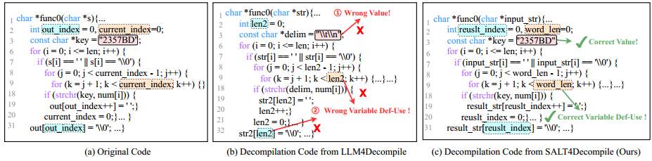
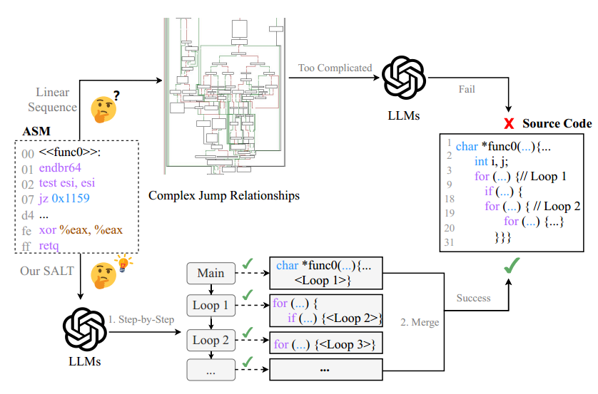

# SALT4Decompile：为基于 LLM 的二进制反编译推断源级抽象逻辑树

作者：Yongpan Wang, Xin Xu, Xiaojie Zhu, Xiaodong Gu, Beijun Shen

预印本

SALT4Decompile，一种新颖的二进制反编译方法，它抽象了二进制和源代码之间共享的稳定逻辑特征。 

SALT4Decompile的核心思想是将选定的二进制级操作（例如特定的跳转）抽象为高级逻辑框架，以更好地指导LLM进行语义恢复。给定一个二进制函数，SALT4Decompile 从汇编代码构造一个源级抽象逻辑树（SALT），以近似高级语言的逻辑结构。

然后，它使用重构的 SALT 微调 LLM 以生成反编译代码。

最后，通过纠错和符号恢复对输出进行细化，以提高可读性和正确性。

# 背景&挑战

- 汇编代码中的**任意地址跳转**对 LLM 正确恢复源代码逻辑提出了重大挑战，这个问题在解释嵌套循环时尤其明显，其中 LLM 可能很难在控制流跳转的多个级别上保留信息，从而导致错误的变量定义和使用等错误。
- 在反编译过程中，即使是很小的错误也可能导致反编译代码与原始源代码之间的执行行为出现重大偏差。此外，现有方法忽略了重要的硬编码信息，例如嵌入在二进制数据段中的常量值（如图 1 中的①所示），从而难以准确推断缺失值。
- 汇编严格隔离代码和数据部分：**代码通过内存地址访问数据，而数据部分存储源级常量值**。当 LLM 仅处理代码部分时，它们无法恢复关键常量值。由于重建这些常量对于在反编译期间保持语义保真度至关重要，因此此限制直接影响输出的正确性。

(b) 显示 LLM4Decompile（通过将汇编代码视为线性序列来微调 LLM） 生成的结果。随着循环嵌套的增加，LLM4Decompile 错误地将两个变量（图 1 (a) 中的当前索引和输出索引）的定义和用法合并为单个变量（len2，用蓝色和橙色虚线框突出显示），最终导致反编译失败。

与之前直接将汇编代码处理为**线性指令序列**的方法不同，SALT4Decompile 将汇编代码中的特定跳转操作抽象为高级逻辑流（例如，将二进制控制流图中的后沿转换为源代码循环），指导 LLM 更有效地捕获源代码语义。

具体来说，给定二进制代码，SALT4Decompile 会在 CFG 中定位源级循环结构，并标准化汇编指令以合并对数据段的缺失引用，从而生成源级抽象逻辑树 (SALT)。

该树提供了原始二进制运算的更连贯的逻辑流程，显着增强了 LLM 恢复源代码语义的能力。然后，SALT4Decompile 使用 SALT 微调 LLM 以生成反编译代码，并通过修复预定义错误和恢复符号信息进一步优化输出。

# SALT4Decompile

一个示例说明了与之前的作品相比，SALT 如何改进二进制反编译的 LLM

# 数据集和基准选取

使用输入/输出（I/O）样本在三个公共数据集（Decompile-Eval、MBPP、Exebench）上评估

三类基线：通用 LLM、商业反编译器和专用反编译方法（包括四种端到端方法和一种基于精炼的方法）

# 结果

SALT4Decompile 实现了新的最先进性能。例如，在 Decompile-Eval 数据集上，SALT4Decompile 的重新编译率为 96.8%（提高了 4%），重新执行率为 58.7%（提高了 8.9%），测试用例通过率为 70.4%（提高了 10.6%）。

此外，SALT4Decompile 在四种常见代码混淆技术、实际软件和各种模型类型中始终优于基准。

用户调查进一步证实，我们的反编译输出是优于竞争方法的首选。

