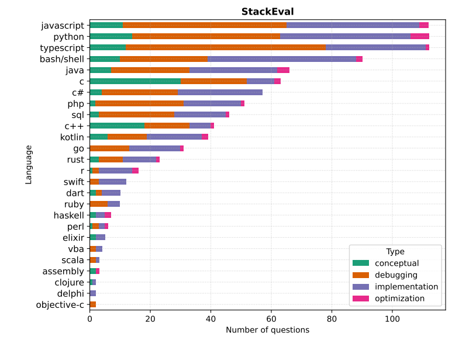
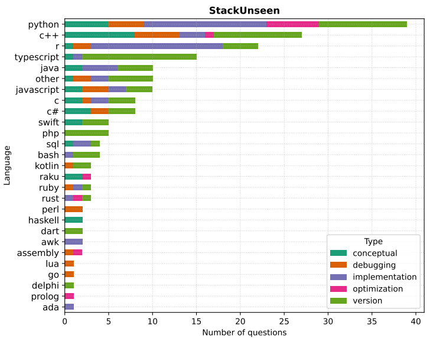
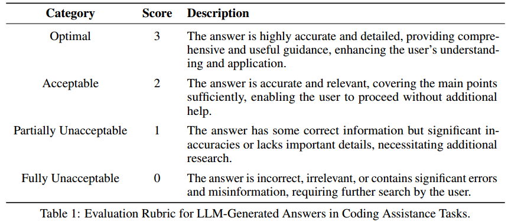
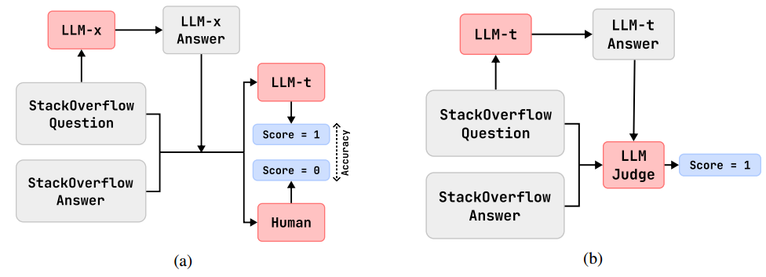
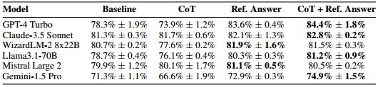
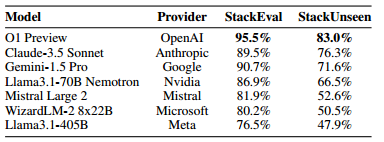
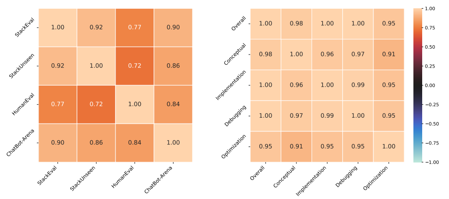
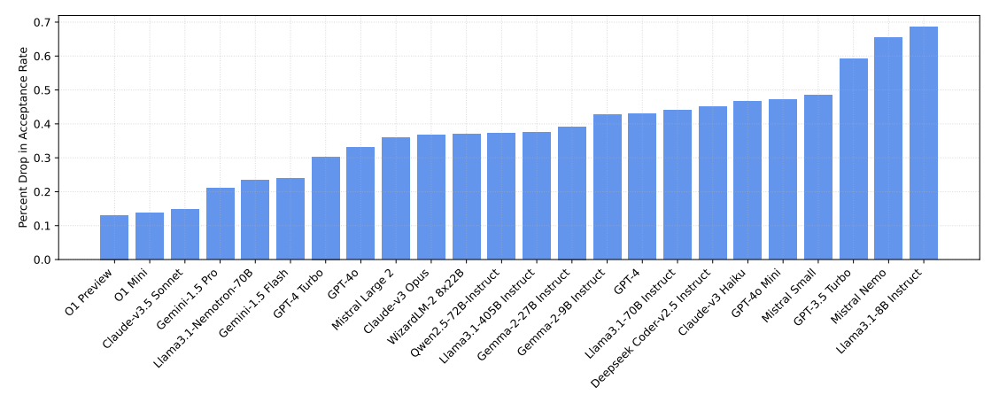
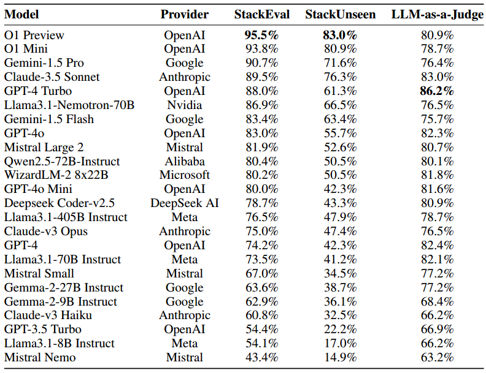
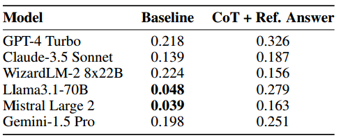

# StackEval

仓库：https://github.com/ProsusAI/stack-eval

会议：**NeurIPS 2024**

作者：**Prosus AI** ：Nidhish Shah; Zulkuf Genc; Zulkuf Genc

- StackEval，综合的多语言、多任务编码基准。包含精心策划的 Stack Overflow 问题，涵盖 25 种编程语言和四种任务类型——调试、实现、优化和概念理解。

  通过利用经过人工验证的解决方案，StackEval 可以对各种编码任务中的 LLM 能力进行全面评估。

- StackUnseen，针对紧急编码挑战的动态基准。专门根据最新的 Stack Overflow 数据转储创建。虽然主要数据集涵盖历史内容，但 StackUnseen 侧重于最近和新兴的编程问题。它不断更新，评估LLM在新技术和不断发展的编码实践方面的表现。

  解决了快速变化的编程环境以及LLM训练集中缺乏最新信息带来的挑战。

  该基准测试缓解了数据泄漏问题，从而能够更准确地评估未见过的编码查询的 LLM 功能。

图1：StackEval 和 StackUnseen 编程语言分发。问题根据编程语言和类型进行细分。语言的分布是根据 2023 年 Stack Overflow 开发者调查 [24] 中所述语言的流行程度进行抽样的。

# 相关工作比较

## 代码基准

HumanEval 是最广泛认可的编码基准，由 164 个 Python 编码问题组成，旨在评估语言模型解决问题的能力。——**小尺寸**和**对单一编程语言的关注**限制了它在综合编码辅助评估中的适用性。自 2021 年起也已公开，这可能导致其**被纳入最近LLM的培训集**中。

SWE-BENCH 提供了一个全面的基准，用于**评估现实世界软件工程任务**的语言模型，利用 2,294 个 GitHub 问题和拉取请求来测试模型编辑广泛代码库的能力。该基准测试揭示了当前最先进模型的显着局限性，这些模型难以应对现实世界代码编辑任务的复杂性和范围。——对 Python 存储库和 GitHub 问题的依赖可能会限制其在不同编程语言和编码助理任务中的通用性。

MultiPL-E 通过将 HumanEval 和 MBPP Python 编码问题翻译成 18 种额外的编程语言，评估语言模型跨不同语言的代码生成能力，扩展了现有基准。它使用经过调整的单元测试来评估语法正确性和功能准确性。——它不会评估模型在代码生成之外的更广泛的编码助理任务中的性能，例如调试和代码审查。

HumanEval-X 和 MBXP 是现有 HumanEval 基准的多语言扩展，将 Python 问题翻译成多种语言。尽管这些基准测试比原始 HumanEval 涵盖更多语言。——仍然仅限于功能完成任务。

## LLMs的评估方法

BLEU 和 ROUGE 等传统指标通常不足以评估代码的正确性和质量。

这导致了包括单元测试在内的基准套件的开发和采用，这些套件提供了对代码功能和正确性更直接、更有意义的评估。然而，在评估**混合了代码和自然语言的开放式编码辅助任务**时，这些传统的指标和单元测试常常达不到要求。这些任务需要理解上下文、意图和人类语言的细微差别，以及技术代码的准确性。这种复杂性需要更复杂和上下文感知的评估方法来有效评估 LLMs 在这些混合场景中的表现。

MT-Bench 和 ChatBot Arena 等框架利用 LLM 来判断响应，**模拟符合人类偏好的同行评审过程**，达成超过 80% 的一致性。这些自动评估框架通常依赖于**成对比较和胜率**。虽然这种方法可以增强评估的稳健性，特别是在缺乏强有力的参考的情况下，但它主要表明哪个模型相对于其他模型表现更好，而**没有提供任务绩效的绝对衡量标准**。此外，成对比较容易受到**位置和冗长偏差**的影响

*为了解决这些限制，我们开发了特定的评估指标和评分标准，以**根据任务目标量化响应**。这种方法可以更清楚地了解模型对当前任务的有效性。此外，我们将经过验证的真实答案纳入自动评估过程中，这有助于评估者专注于相关信息，从而最大限度地减少长文本造成的混乱并减轻立场偏见。*

# 数据集

## 收集和过滤

### 构建

从多个 Stack Exchange 平台（例如 Stack Overflow、Ask Ubuntu、Super User、Unix & Linux、Software Engineering 和 Server Failure）的公共转储中派生出的综合语料库开始。

### 过滤

选择标准要求每个问题至少获得一票赞成，并且接受的答案也获得至少一票赞成，确保社区验证问题的相关性和答案的正确性。

我们排除了包含图像或链接的问答对（这可能会使基于文本的处理变得复杂）以及超过 16,000 个字符的问答对，以保持内容的简洁性。

经过初步过滤后，我们利用 Stack Exchange 标签来识别每个问题中的编程语言。然后，我们根据 2023 年 Stack Overflow 开发者调查所示的受欢迎程度对每种语言的问题进行了抽样，反映了现实世界的使用模式。

### 注解

每个问题都使用 GPT-4 Turbo 进行进一步注释，以对问题类型和复杂程度进行分类。

复杂程度分为初级、中级和高级，提供了一个结构化框架来评估 LLMs 在不同难度下的表现。

此外，问题根据与编码相关的五种不同类型进行标记。这些标签是暗示性的，并不用于对问题进行抽样；它们主要用于分析目的。

问题类型包括：

1. 概念性：旨在更深入地理解编程概念的问题，例如“yield 关键字在 Python 中如何工作？”；
2. 调试：需要解决特定编程错误的问题，例如“为什么我在这段代码中遇到语法错误？”； 
3. 实现：关于执行特定编程任务的问题，通常需要在响应中提供代码片段，例如“如何在 JavaScript 中反转字符串？”；
4. 优化：问题的重点是提高现有代码的效率或征求代码审查，例如“如何优化该算法以获得更好的性能？”； 
5. 版本（仅与 StackUnseen 相关）：需要了解特定（最新）软件版本的问题，例如，“新的 except* 语句在 Python 3.11 中如何工作？”。

### 手动审查

这次审查旨在确认数据集作为有效评估工具的有效性，重点关注三个关键方面：**问题的清晰度、与现实世界编码场景的相关性以及技术准确性**。这些标准对于准确评估 LLMs 在编码相关任务中的能力至关重要。

## 基准套件

StackEval和StackUnseen

the  LLM-as-a-Judge  benchmark，评估LLMs的判断能力

### StackEval Benchmark

旨在评估 LLMs 的**自然语言理解和编码能力**，反映现实世界编码辅助任务的复杂性。

它包括从 2018 年 1 月到 2023 年 9 月抽样的 925 个问题，确保全面覆盖各种编程语言、问题类型和复杂程度。该

数据集的粒度性质允许详细了解不同 LLMs 的具体功能和局限性，有助于更深入地了解他们在一系列编码任务中的表现。

### StackUnseen Benchmark

解决了**编码实践的动态本质和编程语言的不断发展**。 

StackUnseen 的第一个版本涵盖了 2023 年 9 月至 2024 年 3 月的问题，现在已扩展到包括 2024 年 3 月至 2024 年 5 月的额外一组问题。

该基准**每半年更新一次新问题**，确保数据集保持相关性和挑战性，**反映软件开发的最新趋势**。

纳入近期的问题有助于防止潜在的测试-训练数据泄露，并能更及时地评估大型语言模型（LLM）的能力。

定期更新可以对大型语言模型的性能进行纵向研究，从而深入了解这些模型如何适应新数据，以及它们是否会随着时间的推移表现出任何学习或适应能力。

###  LLM-as-a-Judge  Benchmark

包含从 StackEval 基准中精心挑选的 136 个问题，这些问题的选择旨在确保涵盖具有代表性的复杂程度和主题组合。

对于每个问题，都会使用一个大型语言模型（在图 2 中称为 LLM-x，该模型是 GPT-4 Turbo [22]、GPT-3.5 Turbo [7]、CodeLlama-34B [29] 或 Mistral Medium [14] 中的一种）生成答案。

然后，该大型语言模型生成的答案会由人类领域专家进行评估，专家们根据**表 1** 中列出的评估标准，将其与 Stack Overflow 上原有的已被采纳的答案进行比较。

之后，第三位领域专家会对这些标注进行验证，以确保其一致性和准确性。

这种多层级的标注流程旨在为评估大型语言模型在编码相关任务中作为评判者的表现提供一个可靠的数据集。

表1：大型语言模型生成的代码辅助任务答案评估标准

# 评估方法

与具有预定义正确答案的传统基准不同，编码问题通常有多个有效的解决方案，使得客观评估变得复杂。为了应对这一挑战，我们采用了 ** LLM-as-a-Judge  [41] 评估框架**，该框架允许进行考虑编程查询固有的复杂性和可变性的评估。

我们的评估框架包含四个关键组成部分，

1. i）问题：来自 Stack Overflow 的原始问题；
2. ii) 参考答案：Stack Overflow 上得票最高的已接受答案，作为质量和相关性的基准； 
3. iii) LLM- generated Answer：由正在评估的语言模型产生的解决方案；
4. iv) 思想链推理：模型评估中鼓励的逐步分析过程。

提出了**接受分数指标**。该指标评估三个关键维度生成的响应：准确性、完整性和相关性。

为了使响应被认为可以接受，它必须在所有三个方面都表现出色；任何导致用户继续寻找解决方案的缺陷都会导致响应不可接受。

我们分两个阶段进行评估，每个阶段都侧重于模型性能的不同方面。

图 2 总结了这两个阶段
图2：用于评估大语言模型（LLMs）在编码任务上表现的评估方法。
a) 大语言模型作为评判者基准（思维链（CoT）+ 参考答案），在评估大语言模型-x（LLM-x）的答案时，将被测模型（LLM-t）与人类专家进行比较。
b) 编码辅助评估，即由被测模型（LLM-t) 生成StackOverflow答案，再由大语言模型评判者进行评分。

##  LLM-as-a-Judge 

在这一阶段，我们评估**模型准确评估编码解决方案**的能力。

我们比较了几种评估方法，指示模型根据表1中的评估标准输出分数，所提供的不同组成部分如下：

1. 仅问题和答案：模型只收到问题和待评估的答案，没有任何额外的上下文或指导。
2. 问题、答案和参考资料：模型收到问题、待评估的答案以及参考答案（来自Stack Overflow的得票最高的已采纳答案）。这种配置使模型能够将给定答案与高质量的基准进行比较。
3. 带有思维链的问题和答案：模型收到问题和答案，并附有说明，以分析问题的要求并在评分之前检查答案的准确性、完整性和相关性，这可能会导致更经过深思熟虑的评估。
4. 问题、答案、参考和思维链：模型接收所有元素，并被指示使用思维链推理，将参考比较与结构化分析相结合。

我们根据人类贴标者的接受分数报告**准确性**（根据可接受性进行二值化）。

准确性指标反映了 LLMs 的评估与人类专家的评估的一致程度。选择该指标是为了量化模型区分可接受和不可接受的编码解决方案的能力。

## 编码协助

在这个阶段，我们评估**模型生成高质量编码解决方案**的能力。

我们报告**接受率**，即模型生成的解决方案被认为可接受的比例，根据评估标准从 2 或 3 的接受分数得出。这种方法确保生成的响应不仅在技术上准确，而且实际适用且适合上下文

# 实验

## LLM-as-Judge Benchmark

与任何自动化评估系统一样，将大型语言模型（LLMs）用作评判者会引发关于可靠性和一致性的重要问题。

这些模型可能**难以进行细致的技术评估**，或者会**因在特定编程范式上的训练而表现出偏见**，这可能会影响其评估的公正性。

为了缓解这些担忧，我们使用**人工标注**来验证大型语言模型评判者的评估结果。

“LLM-as-Judge”基准由多个元组组成，每个元组包含**一个Stack Overflow问题**、一个**由大型语言模型生成的解决方案**，以及（如适用）**Stack Overflow上被采纳的答案**。

这些元素被用于构建第4节中所述的评判提示。响应生成采用近乎确定性的温度设置（T = 0.01）和固定的种子（s = 42）进行配置。然后，我们通过使用准确度指标将模型的接受分数与人工标注的评分进行比较，来评估模型与人类判断的一致性。我们在表2中报告了10次运行的**平均评估准确度**。

表2：在使用和不使用 Chainof-Thought (CoT) 推理和访问参考答案的情况下，在不同的提示配置中评估选定的 LLM 的平均准确度 ± 95% 置信区间

- 访问参考答案始终可以提高所有测试模型的评估准确性，这表明基于比较的评估比独立评估更可靠。
- 思想链（CoT）推理本身并不能提高性能，并且在某些情况下会稍微降低性能，这表明没有适当上下文的结构化推理可能会导致过度思考或错误分析。
- 虽然结构化推理可能是有益的，但获得高质量的参考解决方案是准确评估的更关键组成部分。

## StackEval 和 StackUnseen 基准测试

在StackEval和StackUnseen基准上评估大型语言模型（LLMs）时，我们直接向每个大型语言模型呈现编码问题，不提供补充提示或指令。

响应生成配置为接近确定性的温度设置（T = 0.01）和固定种子（s = 42），输出限制为2048个标记。

然后，我们使用“ LLM-as-a-Judge ”框架对这些响应进行评估，采用图8中详细说明的评估提示。不同提供商的各种大型语言模型的接受率如表所示。

表3：各种法学硕士在编码辅助基准上的表现接受率。 （完整结果请参见附录中的表 5)

- 整合了推理链的O1 Preview模型在各项基准测试中均取得了最高性能。
- 值得注意的是，像Llama3.1-70B Nemotron和WizardLM-2 8x22B这样的开源模型与专有产品具有竞争力，这表明开源大型语言模型和商业大型语言模型之间的差距正在缩小。

图3：左图：不同编码基准的模型性能之间的相关性显示出很强的正相关性 (0.72-0.92)。
右图：基准测试中不同问题类型的模型表现高度相关 (0.91-1.00)，表明不同任务类别的表现一致。

- 对StackEval和StackUnseen基准的分析显示，模型排名具有一致性（表5），这表明无论是在历史内容还是新兴内容上，模型都具有稳定的性能特征。
- 然而，我们发现模型**在未见过的内容上的接受率显著下降**。
- 图4显示，容量更大的模型以及那些使用推理链的模型（即在StackEval中表现出色的同一批模型）在新问题上表现出**更好的泛化能力**。
- 这表明，那些推动模型在已有问题上表现优异的能力，同样有助于它们更好地应对未见过的挑战。

图4：模型在最近问题上的性能下降。 在StackEval评分较高的大型语言模型（LLMs)在StackUnseen上的接受率下降幅度更小，这表明它们在当代问题上具有更好的泛化能力。

表5：各种 LLM 在编码辅助基准（StackEval 和 StackUnseen）以及  LLM-as-a-Judge  基准（CoT + Ref.答案)。

## LLM法官的自我偏好性

先前的研究已经发现了基于大型语言模型（LLM）的评估系统中存在潜在偏差，特别是自我偏好现象，即模型可能会优先给自身生成的内容打分。虽然这类偏差*在摘要等主观性任务中已得到证实*，但尚未有系统性研究考察代码评估场景下的自我偏好问题。

我们分析了在有参考答案和无参考答案的情况下，作为评判者的大型语言模型如何评估自身生成的代码与其他模型生成的解决方案。

我们的研究聚焦于**编程任务**，这类任务通常至少有一个正确的解决方案，这为考察客观正确的解决方案是否会影响自我偏好行为提供了机会。

图4：自我偏好分析结果。来自 Wilcoxon 符号等级测试的 P 值，用于比较自我分数与其他分数。粗体表示 p < 0.05，其中我们拒绝 H0 而支持 H1，表明存在自我偏好偏差。

我们使用表2中详细列出的模型，在所有模型上生成并评估了响应。与之前的实验一致，我们保持**温度T=0.01和固定的种子（s=42）**。每个模型既评估自己生成的解决方案，也评估其他模型生成的解决方案。

为了分析自我偏好的存在，我们进行了Wilcoxon Signed Rank Test（威尔科克森符号秩检验）来研究以下假设：其中，自我评分（Si）表示模型m给自己的解决方案打的分数，他人评分（So）表示所有其他模型针对相同问题给模型m打的平均分数。

- H0：自我评分（Si）和他人评分（So）之间的中位数差异为零。
- H1：自我评分（Si）和他人评分（So）之间的中位数差异大于零。

参照表4，与先前研究的预期相反，

- 在有参考答案的情况下，我们在所有模型中始终无法拒绝原假设H0（所有p值均>0.05）。
- 在没有参考答案的情况下，六个案例中有四个我们无法拒绝原假设H0，其余两个案例则出现边缘显著的拒绝情况（p=0.048和p=0.039）。

这些发现表明，**参考答案可能充当了客观锚点，消除了自我偏好偏差**；而**即使没有此类锚点，在编码任务中这种偏差也显得极小**。

这些结果表明，在存在客观正确性标准的领域（如编程任务），基于大语言模型（LLM）的评估系统可能比在更主观的领域更不易受自我偏好偏差的影响。

# 讨论（局限性）

## 数据集管理

Stack Overflow 虽对程序员而言是宝贵资源，却存在**源于其社区准则和投票系统的固有偏见**。

- 该平台强调实用性强、具体明确的问题，这一倾向更青睐可立即应用的解决方案，可能导致**数据向侧重实现的内容倾斜**。
- **严格的审核政策往往会排除主观性、探索性或非传统的问题**，进而缩小了所呈现主题的范围。
- 此外，**社区偏好简洁、以代码为核心的答案**，这进一步让回复偏向实用型解决方案。
- 热门技术和编程语言通常能获得更多关注及更高质量的回答，导致编程知识不同领域的呈现不均衡。投票系统会放大这种效应 —— **推广与主流兴趣相符的内容，可能使小众但有价值的贡献被掩盖**。

我们基于 Stack Overflow 数据构建的基准测试继承了这些特征，反映了各类真实场景下的编程问题及解决方案。该基准测试在呈现经社区验证的实用编程知识方面表现出色，但**可能无法全面捕捉大语言模型在所有编程范式或理论层面的能力**。研究人员在解读基准测试结果时应考虑这些局限性，并通过其他补充评估方法，以全面了解大语言模型在编码任务中的表现。

## 评估方法

我们将大语言模型（LLMs）用作评估编码辅助能力的评估法官，这种方法在效率和可扩展性方面具有显著优势。尽管我们已对 LLM-as-a-Judge 的准确性和自我偏好展开全面研究，但必须承认其存在固有局限性。

这些评估法官可能会受到与被评估模型相同的限制，可能导致**评估盲点**，尤其在高度专业化或复杂的编码任务中。

此外， LLM-as-a-Judge 可能会对其训练数据中普遍存在的**特定响应风格**表现出偏见，这种偏见难以检测和量化，可能会不顾解决方案质量而导致评估结果失真。

我们的方法侧重于**单轮模型预测**，这为评估提供了标准化路径，但并未考虑能够运行和验证代码的大语言模型智能体。

同时，我们的评估标准**主要衡量代码解决方案的正确性和相关性**，可能无法全面捕捉现实世界软件开发中的关键方面，例如代码效率、可维护性或对最佳实践的遵循程度。这些因素虽至关重要，但利用当前大语言模型的能力进行一致性评估仍面临巨大挑战。

此外，我们的 “大语言模型作为评估法官” 基准测试虽较为全面，但**基于 Stack Overflow 问题的静态快照构建**。这种时间局限性可能会影响评估法官的长期有效性，因为它们的表现可能会随新型或不同类型的问题而变化。

因此，有必要对 LLM-as-a-Judge 进行持续更新和重新评估，以确保它们在快速发展的软件开发领域中始终保持有效性和相关性。

# 总结

- StackEval 基准测试显示，大语言模型在历史内容和常见编程任务上表现极为出色。但随着问题变得更加复杂和小众，它们的准确性会显著下降。
- StackUnseen 基准测试进一步证实了大语言模型在泛化能力上面临的挑战。当面对新兴技术和最新编程实践时，与在成熟编程范式上的表现相比，大语言模型的性能会出现大幅下滑。

这种性能差距体现了当前大语言模型对快速演变的编码环境的适应局限性。

- 大语言模型的训练数据来自**质量参差不齐的公开代码库**，由于这些数据集中标杆级代码的数量有限，模型可能会延续或加剧现有代码质量问题。
- 训练数据中存在的偏见也可能通过模型被延续，进而可能导致不公平或歧视性的结果。随着该领域的发展，制定**新的代码审查、测试和问责标准**至关重要 —— 这些标准需要平衡人工智能辅助与人类专业知识，同时持续监控并解决上述问题，以确保技术的良性发展。

