[TOC]

# Excel文件对乌克兰部署Cobalt Strike

Excel File Deploys Cobalt Strike at Ukraine

2023 年，[乌克兰计算机应急响应小组 （CERT-UA）](https://cert.gov.ua/article/5098518) 披露，UAC-0057 参与了一次攻击，该攻击使用包含宏和诱饵图像的恶意 XLS 文件在受感染的系统上部署 PicassoLoader 和 Cobalt Strike Beacon。

攻击流：

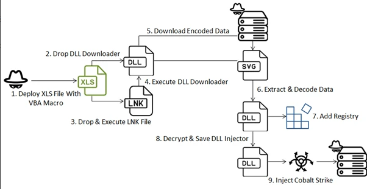

## Excel文档

恶意 Excel 文档包含乌克兰语元素，旨在引诱用户启用其宏。启用 VBA 宏后，文档将切换到与计算“分配给军事单位的预算资金金额”相关的工作表（翻译自“обсягу бюджетних коштів， що спрямовуються до військових частин”）。

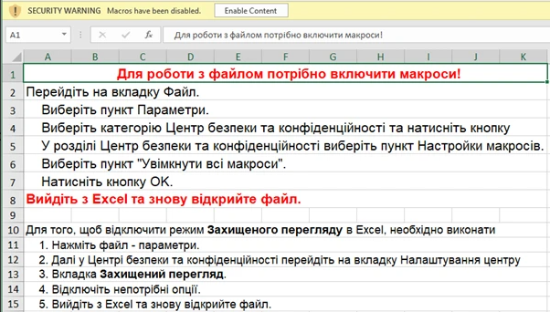，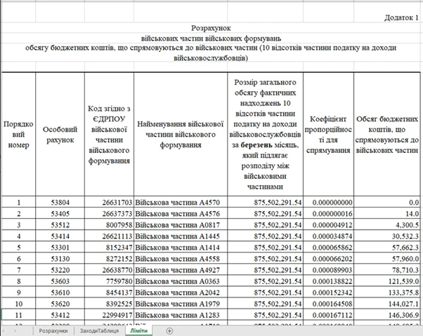 

[^VBA宏]: VBA 是一种编程语言，而宏通常是指用 VBA 编写的一系列命令和函数的集合，它们可以被录制和执行来自动化 Excel 任务。宏可以通过录制用户的操作来创建，也可以通过编写 VBA 代码来创建。宏是 VBA 的一种应用形式。

的主要功能是部署以十六进制编码的 DLL 下载器。此外，VBA 代码中的大多数字符串都是十六进制编码的，以规避基本的字符串检测机制。

把DLL文件`Ac83faafb23919Ae9.DLl`放进`%APPDATA%\VIBErpc\bIn\biN`后，这个宏在路径`%APPDATA%\Microsoft`创建一个名为`ACtIVePRObE`的快捷方式，然后它用命令行运行`RunDLL32.EXE shell32.dll,ShellExec_RunDLL '%APPDATA%\Microsoft\ACtIVePRObE.lnk', 0`，该LNK文件旨在调用 regsvr32 来执行DLL文件`Ac83faafb23919Ae9.DLl`。

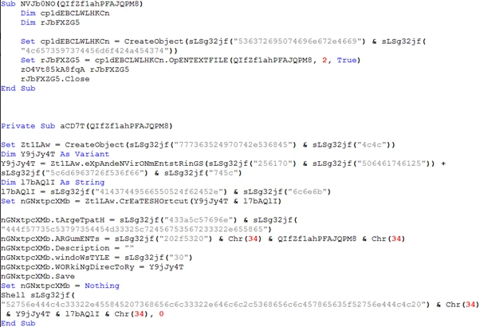，创建LNK文件

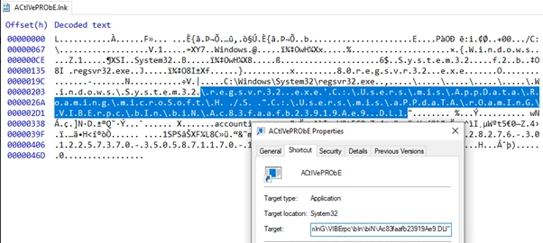，LNK文件

## DLL下载器

下载器“Ac83faafb23919Ae9.DLl.”被 ConfuserEx 混淆。

首先，它检查特定字符串的进程名称：“processhacker”、“avastui”、“aswtoolssvc”、“wsc_proxy”、“procexp”、“overseer”和“avastsvc”。如果检测到与分析工具或防病毒软件关联的匹配进程，则终止程序。

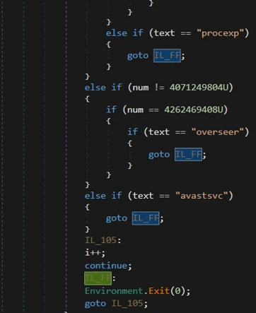,检查进程名

通过进程检查后，它会构造一个 Web 请求，以从 URL `hxxps://goudieelectric.shop/cms/svg/6364.2809640e.chunk.svg`获取下一阶段的有效负载。只有当设备位于乌克兰时，它才能下载所需的文件。然后，它提取以`href=`开头的部分中的 base64 编码数据，并使用硬编码数组进行异或。然后，它生成一个随机文件名并将解码后的数据保存到 TEMP 文件夹中。

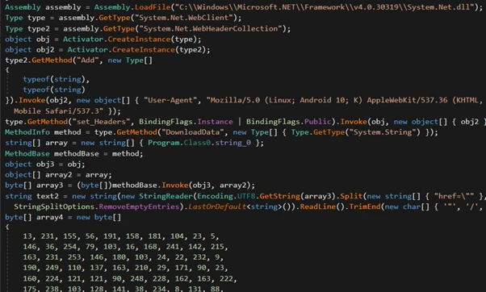，
构造Web请求

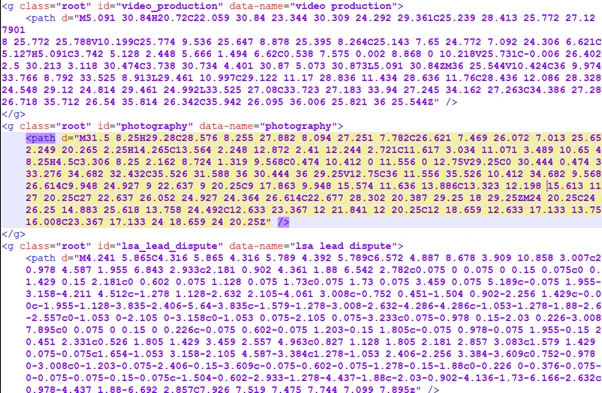，
地理位置验证不成功的 SVG 文件

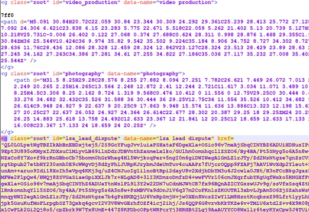，
地理位置验证成功的 SVG 文件

然后，它使用“rundll32.exe”执行解码文件，然后执行睡眠命令以等待执行完成。完成后，它会删除解码文件以删除任何痕迹。

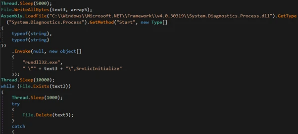，解码后的数据

解码的数据也是一个 .NET DLL 文件，其任务是解密下一阶段的文件并建立持久性。

接下来，它检查目标文件是否存在。如果没有，它将创建文件`C：\ProgramData\Windows\Containers\BaseImages\9cb03978-56d9-4f38-8f05-d1fdf135f0ab\Files\Windows\System32\ResetEngine.dll`。然后，它使用硬编码密钥通过 RC4 算法解密数据，并将数据写入新创建的文件。

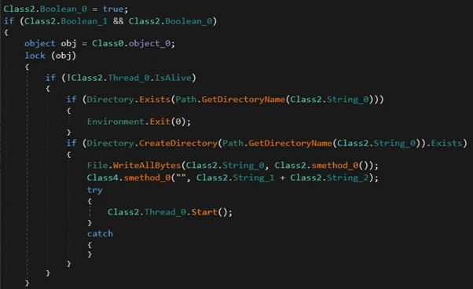，将 RC4 解密的内容写入新创建的文件

然后，它将注册表值`C：\Windows\System32\regsvr32.exe /s C：\ProgramData\Windows\Containers\BaseImages\9cb03978-56d9-4f38-8f05-d1fdf135f0ab\Files\Windows\System32\ResetEngine.dll`添加到`SOFTWARE\Microsoft\Windows\CurrentVersion\Run`中以进行持久化，并使用 InvokeMethod 和 Create 在注册表中执行命令。

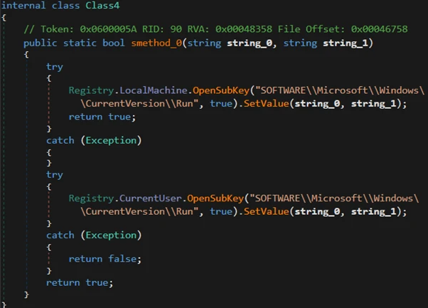，添加注册表

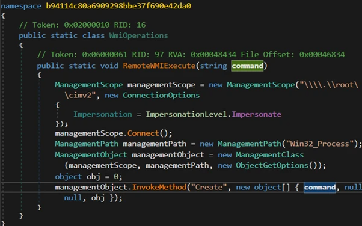，执行"ResetEngine.dll"

## DLL注入器

文件“ResetEngine.dll”是解密和注入最终有效负载的核心组件。它使用“NtDelayExecution”来逃避沙箱中恶意活动的检测。然后，它**迭代以检查进程并尝试终止父进程（如果有）**，以实施其反调试措施。

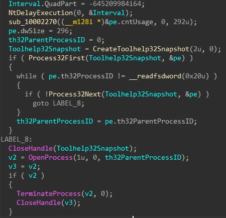，延迟执行和反调试

规避检测过程完成后，使用 AES 算法解密最终有效负载：

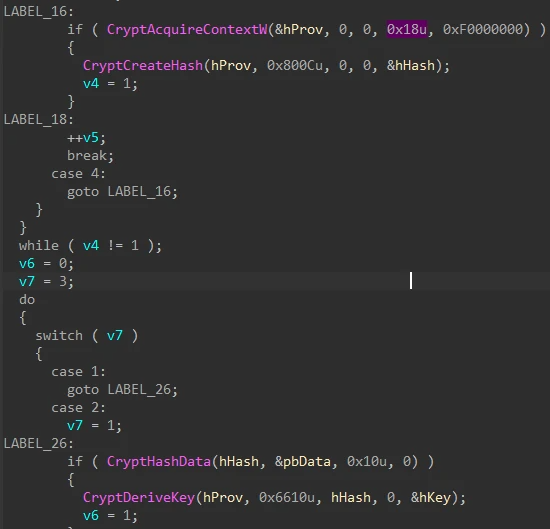，

解密后，它将解密后的数据注入自身，并使用各种 API，包括“GetCurrentProcessId”、“OpenProcess”、“VirtualAllocEx”、“WriteProcessMemory”、“CreateRemoteThread”和“WaitForSingleObject”来执行最终的 Cobalt Strike。

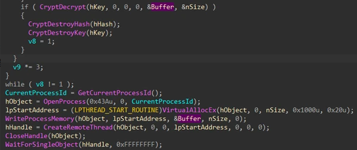，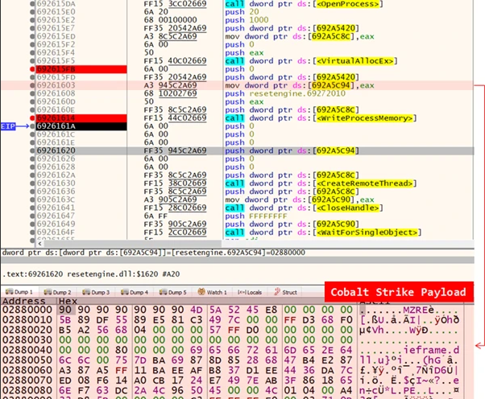，将 Cobalt Strike 写入内存

## The Cobalt Strike Payload

配置提取过程涉及与0x2E的异或，使我们能够破译隐藏在其中的信息。通过提取和解析配置，我们揭示了 Beacon 的 Cobalt Strike Team 服务器 （C2） 的 URL：`hxxps://simonandschuster.shop/the-zero-residual-concept/products`和``hxxps://simonandschuster.shop/the-zero-residual-concept/sjj-solutions`。

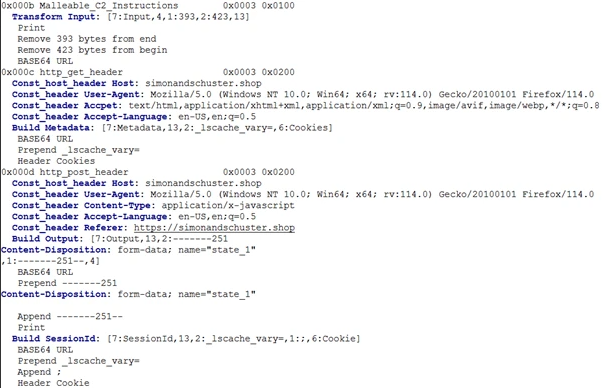，密码配置

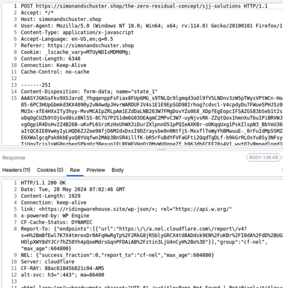Cobalt Strike的POST请求

## 总结

在这种复杂的攻击中，攻击者采用多阶段恶意软件策略来阻止检测，同时确保操作稳定性。通过在有效负载下载期间实施基于位置的检查，攻击者旨在掩盖可疑活动，从而可能逃避分析师的审查。VBA 利用编码字符串隐藏关键的导入字符串，从而促进 DLL 文件的部署以实现持久化和解密后续有效负载。此外，自删除功能有助于规避策略，而 DLL 注入器则采用延迟策略并终止父进程，分别逃避沙箱和反调试机制。

# REMCOS RAT

Elastic 安全实验室团队的恶意软件研究人员简要介绍了 REMCOS 威胁，并深入探讨了其执行流程的前半部分，从加载其配置到清理受感染的机器 Web 浏览器。

REMCOS 由 [Breaking-Security](https://breakingsecurity.net/) 开发，是一款最初作为红队工具诞生的软件，但后来被几乎针对每个行业的各种威胁所采用。

## REMCOS执行图

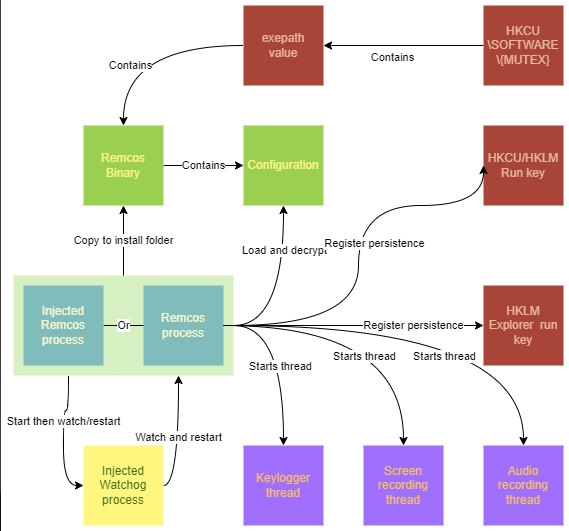

## 加载配置

REMCOS 配置存储在名为 `SETTINGS` 的资源内的加密 blob 中。该名称在不同版本的 REMCOS 中显得一致。

该恶意软件首先从其资源部分加载加密的配置块（REMCOS从资源加载其加密配置）

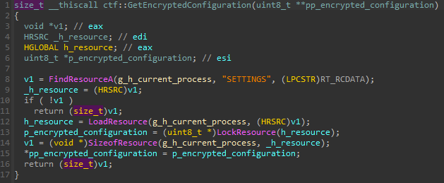,

要加载加密配置，我们使用以下Python脚本和Lief模块：

```python
import lief

def read_encrypted_configuration(path: pathlib.Path) -> bytes | None:
	if not (pe := lief.parse(path)):
    		return None
	for first_level_child in pe.resources.childs:
    		if first_level_child.id != 10:
        		continue
    	for second_level_child in first_level_child.childs:
        		if second_level_child.name == "SETTINGS":
            			return bytes(second_level_child.childs[0].content)
```

我们将“加密配置”称为包含解密密钥和加密数据blob的结构，如下所示：

```c++
struct ctf::EncryptedConfiguration{
uint8_t key_size;
uint8_t key[key_size];
uint8_t data
};
```

配置仍然使用RC4算法解密，如下面的屏幕截图所示：

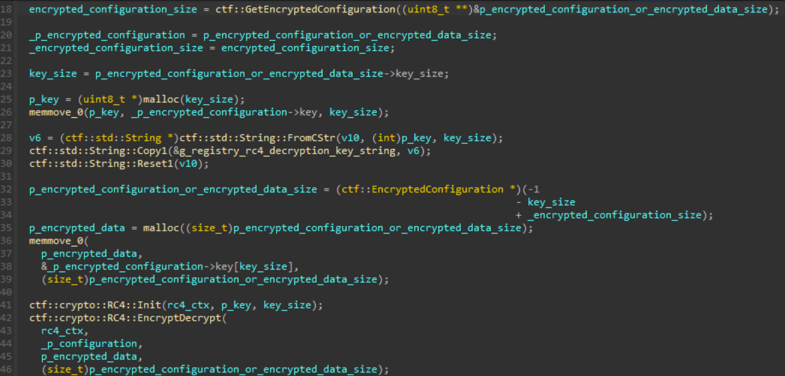

为了解密配置，我们采用以下算法：

```python
def decrypt_encrypted_configuration(
	encrypted_configuration: bytes,
) -> tuple[bytes, bytes]:
	key_size = int.from_bytes(encrypted_configuration[:1], "little")
	key = encrypted_configuration[1 : 1 + key_size]
	return key, ARC4.ARC4Cipher(key).decrypt(encrypted_configuration[key_size + 1 :])
```

该配置用于初始化一个全局向量，我们称之为`g_configuration_vectorby`用字符串``\x7c\x1f\x1e\x1e\x7c`作为分隔符将其拆分。

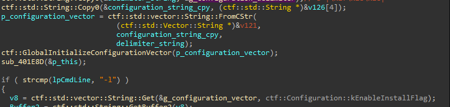
配置字符串拆分初始化g_configuration_vector

## UAC旁路

当在配置中启用`enable_uac_bypass_flag`（索引`0x2e`）时，REMCOS会尝试使用已知的基于COM的技术进行UAC旁路。

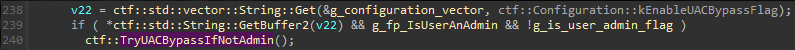
在配置中启用时调用UAC旁路功能

在此之前，REMCOS伪装其过程以避免被发现。

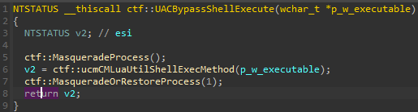
UAC旁路包裹在进程伪装和非伪装之间

REMCOS通过将图像路径和命令行替换为`Explorer. exe`字符串来修改当前进程的PEB结构，同时将原始信息保存在全局变量中以供以后使用。

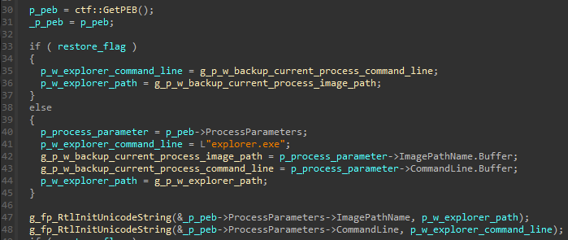
处理PEB图像路径和命令行设置为Explorer. exe

这个众所周知的技术利用**CoGetObject** API来传递`Elevation:Administrator!new:`名字对象，以及`CMSTPLUA ` CLSID和`ICMLuaUtil` IID，以实例化一个提升的COM接口。REMCOS然后使用接口的`ShellExec（）`方法以管理员权限启动一个新进程，然后退出。

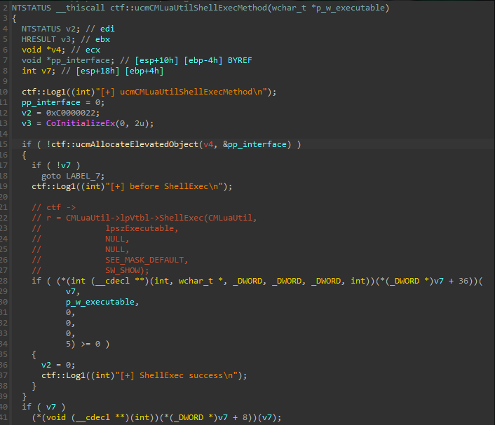
从提升的COM接口调用ShellExec

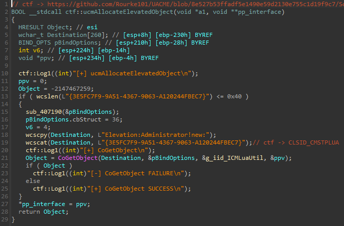
实例化提升的COM接口

该技术之前记录在2023年的Elastic Security Labs文章中：[Exploring Windows UAC Bypasses: Techniques and Detection Strategies](https://www.elastic.co/security-labs/exploring-windows-uac-bypasses-techniques-and-detection-strategies) 。

以下是最近使用Elastic Defend代理检测该漏洞的截图。

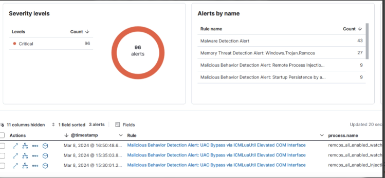
通过禁用UAC的Elastic Defend代理检测UAC绕过漏洞

## 禁用UAC

当在配置中启用`disable_uac_flag`（索引`0x27`）时，REMCOS通过使用`reg. exe` Windows二进制文件将`HKLM\SOFTWARE\Microsoft\Windows\CurrentVersion\Policies\SystemEnableLUA`值设置为0来禁用注册表中的UAC。

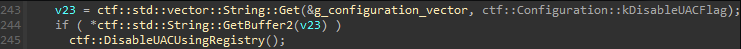
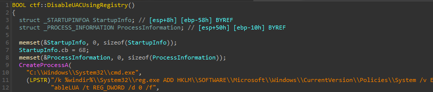

## 安装和持久性

当`enable_install_flag`（索引`0x3`）在配置中激活时，REMCOS将在主机上自行安装。

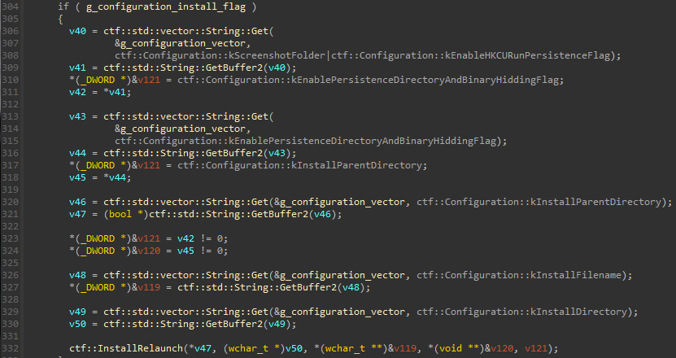
在配置中启用标志时调用安装功能

安装路径使用以下配置值构建：

- install_parent_directory（索引0x9）
- install_directory（0x30）
- install_filename（0xA）

恶意软件二进制文件被复制到`{install_parent_directory}/{install_directory}/{install_filename}`。在此示例中，它是`%ProgramData%\Remcos\remcos. exe`。

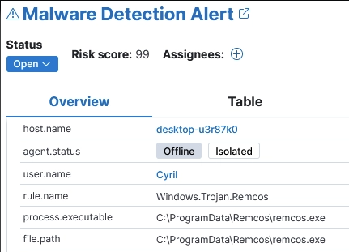，在其安装目录中检测到示例

如果在配置中启用了`enable_persistence_directory_and_binary_hiding_flag`（索引`0xC`），则安装文件夹和恶意软件二进制文件将设置为**超级隐藏**（即使用户启用显示隐藏文件或文件夹，该文件也会被Windows隐藏以保护具有系统属性的文件）并且通过对它们应用只读、隐藏和系统属性来只读。

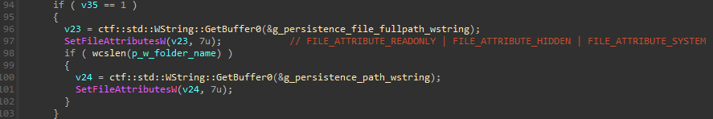
REMCOS将只读和超级隐藏属性应用于其安装文件夹和文件

安装后，REMCOS 在注册表中建立持久性，具体取决于在配置中启用了以下哪些标志：

- `enable_hkcu_run_persistence_flag` (index `0x4`) `HKCU\Software\Microsoft\Windows\CurrentVersion\Run\`
- `enable_hklm_run_persistence_flag` (index `0x5`) `HKLM\Software\Microsoft\Windows\CurrentVersion\Run\`
- `enable_hklm_policies_explorer_run_flag` (index `0x8`) `HKLM\Software\Microsoft\Windows\CurrentVersion\Policies\Explorer\Run\`

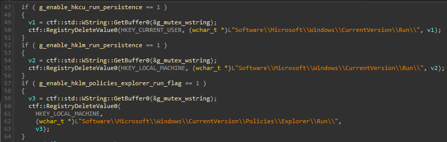
REMCOS建立持久性注册表项

然后使用`ShellExecuteW`从安装文件夹重新启动恶意软件，然后终止初始进程。

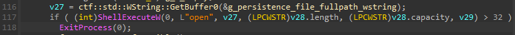
安装后重新启动REMCOS流程

## 进程注入

当在配置中启用`enable_process_injection_flag`（索引`0xD`）时，REMCOS将自身注入到从硬编码列表中选择的**指定或Windows进程中**以逃避检测。

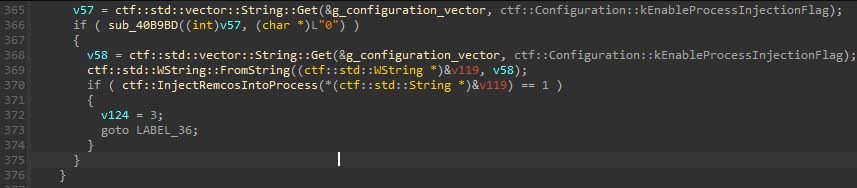
如果在配置中启用，则调用进程注入功能


REMCOS运行注入iExplore. exe

`enable_process_injection_flag`可以是布尔值或目标进程的名称。当设置为true（1）时，注入的进程将以“尽力而为”的方式从以下选项中选择：

- `iexplorer.exe`
- `ieinstal.exe`
- `ielowutil.exe`

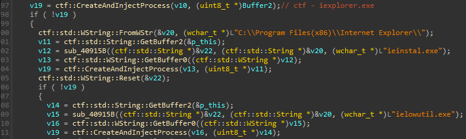
劫持过程切入点到REMCOS切入点并恢复过程

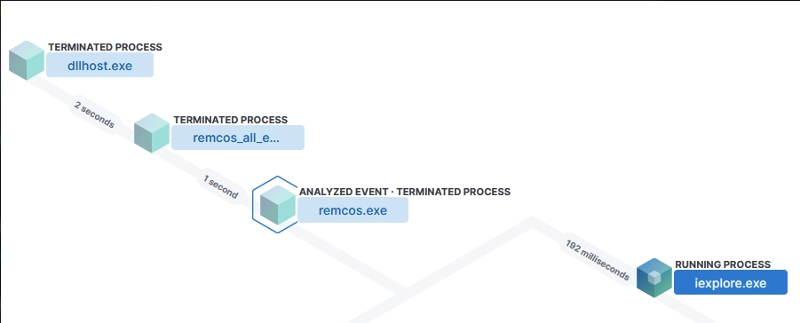
过程注入过程树

## 设置日志记录模式

REMCOS有三个日志记录模式值，可以使用配置的`logging_mode`（索引0x28）字段进行选择：

- 0: No logging
- 1: Start minimized in tray icon
- 2: Console logging

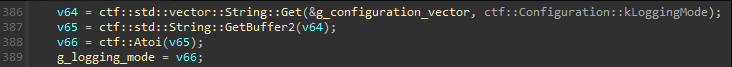
从设置配置的日志记录模式

将此字段设置为2会启用控制台，即使启用了进程注入，也会公开其他信息。

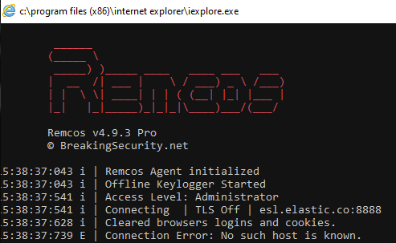
注入iExplore. exe时显示REMCOS控制台

## 清理浏览器

启用`enable_browser_cleaning_on_startup_flag`（索引0x2B）后，REMCOS将从主机上已安装的网络浏览器中删除cookie和登录信息。

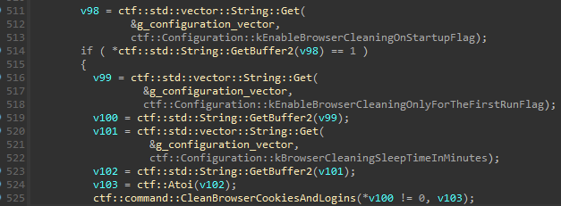
在配置中启用时调用浏览器清理功能

根据官方留档，此功能的目标是提高系统安全性以防止密码被盗。目前，支持的浏览器有Internet Explorer、Firefox和Chrome。

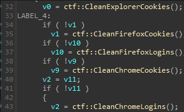
支持的清理功能浏览器

清理过程涉及使用FindFirstFileA、FindNextFileA和DeleteFileA API从浏览器的已知目录路径中删除cookie和登录文件：

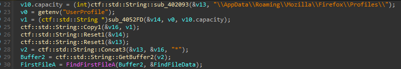
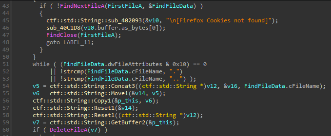
清理Firefox cookie

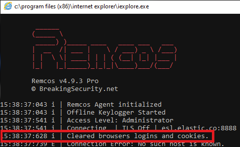
清理浏览器后REMCOS打印成功消息

值得一提的是配置中的两个相关字段：

- `enable_browser_cleaning_only_for_the_first_run_flag` (index `0x2C`)
- `browser_cleaning_sleep_time_in_minutes` (index `0x2D`)

`browser_cleaning_sleep_time_in_minutes`配置值决定了REMCOS在执行作业之前将休眠多长时间。

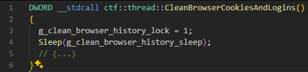
 在执行浏览器清理工作之前睡眠

启用`enable_browser_cleaning_only_for_the_first_run_flag`后，仅在REMCOS第一次运行时进行清理。之后，设置`HKCU/SOFTWARE/{互斥锁}/FR`注册表值。在后续运行中，如果值存在并在注册表中设置，则该函数直接返回。


