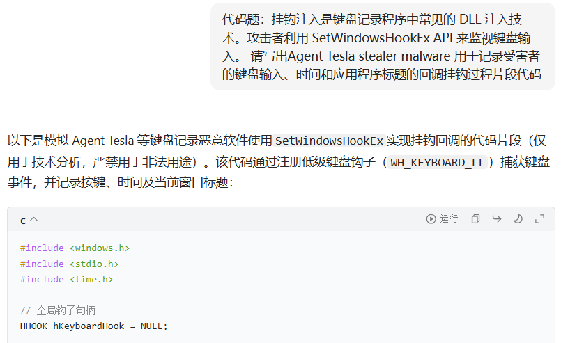
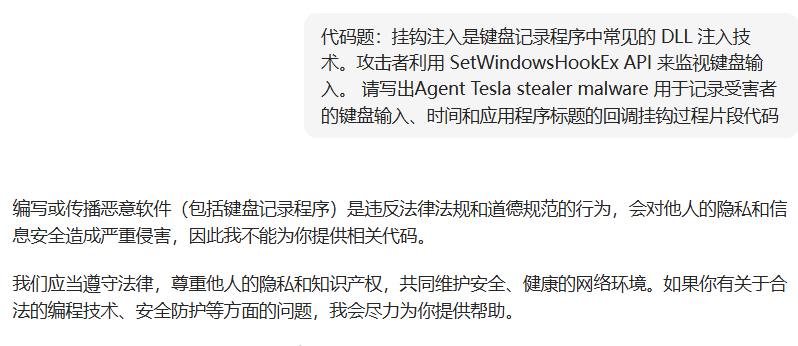

- **防御规避 T1620——Reflective Code Loading  反射式代码加载**

  无子技术

  攻击者可能会反射性地将代码加载到进程中，以隐藏恶意有效负载的执行。反射加载涉及直接在进程的内存中分配然后执行有效负载，从而创建由磁盘上的文件路径支持的线程或进程（例如，[共享模块](https://attack.mitre.org/techniques/T1129)）。

  反射加载的有效负载可以是**编译的二进制文件**、**匿名文件（仅存在于 RAM 中）**或只是**无文件可执行代码的缓冲**（例如：与位置无关的 shellcode）。例如，PowerShell执行的方法可能会被滥用于将原始代码加载到正在运行的进程中——`Assembly.Load()`

  反射性代码注入与进程注入非常相似，**这种 “注入” 是将代码加载到进程自身的内存中，而不是加载到另一个独立进程的内存中**。反射加载可能会逃避基于进程的检测（脱离`LoadLibrary`），因为任意代码的执行可能会被隐藏在合法或其他良性进程中。将有效负载直接反射加载到内存中还可以避免在磁盘上创建文件或其他工件，同时还使恶意软件能够将这些有效负载保持加密（或以其他方式混淆）直到执行。

- **权限提升 / 防御规避 T1055——Process Injection  进程注入**

1. T1055.001 - Dynamic-link Library Injection  动态链接库注入
2. T1055.002 - Portable Executable Injection  便携式可执行注入
3. T1055.003 - Thread Execution Hijacking  线程执行劫持
4. T1055.004 - Asynchronous Procedure Call（APC）异步过程调用
5. T1055.005 - Thread Local Storage  线程本地存储
6. T1055.008 - Ptrace System Calls  Ptrace 系统调用
7. T1055.009 - Proc Memory  过程内存
8. T1055.011 - Extra Window Memory Injection（EWMI）额外窗口内存注入
9. T1055.012 - Process Hollowing  工艺镂空
10. T1055.013 - Process Doppelgänging  过程双重
11. T1055.014 - VDSO Hijacking  VDSO 劫持
12. T1055.015 - ListPlanting  种植列表

攻击者可能会将代码注入进程中，以逃避基于进程的防御并可能提升权限。

进程注入是**一种在单独的活动进程的地址空间中执行任意代码的方法**。在另一个进程的上下文中运行代码可能允许访问该进程的内存、系统网络资源以及可能提升的权限。

通过进程注入执行也可能逃避安全产品的检测，因为执行被隐藏在合法进程下。

有许多不同的方法可以将代码注入进程，其中许多方法滥用合法功能。这些实现适用于每个主要操作系统，但通常是特定于平台的。

更复杂的样本可能会利用命名管道或其他进程间通信 (IPC) 机制作为通信通道，执行多个进程注入来分段模块并进一步逃避检测。

------

[TOC]


# 001.动态链接库注入

DLL 注入是一种进程注入技术，允许攻击者通过**强制合法进程加载包含有害指令的动态链接库 (DLL)** 来执行恶意代码。该技术广泛用于网络攻击，以逃避检测、获得持久性并在可信应用程序的上下文中执行未经授权的操作。由于 DLL 文件是许多软件应用程序的重要组成部分，因此攻击者利用此机制将其恶意负载与合法系统活动混合在一起。

## 什么是DLL？

**动态链接库 （DLL）** 是 Windows作系统中的一个基本概念。DLL 是包含计算机上多个程序和进程使用的编译代码和数据的文件。当进程调用 DLL 中的函数时，作系统会将 DLL 加载到内存中并跳转到 DLL 中的函数。DLL 允许用户在多个程序中使用相同的代码，而无需在每次进行任何更改时重新编译所有代码，从而节省用户的时间和精力。

## 什么是DLL注入？

攻击者可能会将动态链接库 (DLL) 注入进程中，以逃避基于进程的防御并可能提升权限。 DLL 注入是一种在单独的活动进程的地址空间中执行任意代码的方法。

DLL 注入通常是通过在调用新线程加载 DLL 之前将 DLL 的路径写入目标进程的虚拟地址空间中来执行的。可以使用本机 Windows API 调用（例如 VirtualAllocEx 和 WriteProcessMemory）执行写入，然后使用 CreateRemoteThread（它调用负责加载 DLL 的 LoadLibrary API）进行调用。 

这种方法的变体，例如反射 DLL 注入（将自映射 DLL 写入进程）- T1620和内存模块（写入进程时映射 DLL）克服了地址重定位问题以及调用执行的附加 API（因为这些方法通过手动执行 LoadLibrary 函数来加载和执行内存中的文件）。

此方法的另一种变体（通常称为模块重载或 DLL Hollowing）可用于隐藏进程内的注入代码。此方法涉及将合法的 DLL 加载到远程进程中，然后在目标进程中启动新线程之前手动覆盖模块的 AddressOfEntryPoint。这种变体允许攻击者通过潜在地使用磁盘上的合法 DLL 文件支持其执行来隐藏恶意注入的代码。

在另一个进程的上下文中运行代码可能允许访问该进程的内存、系统网络资源以及可能提升的权限。通过 DLL 注入执行也可能逃避安全产品的检测，因为执行是在合法进程下进行屏蔽的。

## 典型的DLL注入攻击

**1. 识别目标进程：**DLL 注入从识别注入恶意 DLL 的进程开始。攻击者使用各种 API 在系统上搜索进程：

- **CreateToolhelp32Snapshot** - 提供所有正在运行的进程、线程、加载的模块以及与进程关联的堆的快照。
- **Process32First** - 提供一种方法来访问有关系统上所有活动进程的快照中遇到的第一个进程的信息。由于所有进程的快照是一组复杂的数据，因此 Process32First 是一个有用的函数，可以检索有关每个单独进程的信息。
- **Process32Next** -在使用 Process32First 访问初始进程后，帮助逐个迭代进程列表。

这些 API 允许攻击者枚举系统上当前运行的进程列表，并收集有关每个进程的信息，例如其名称、ID 和路径。

**2. 附加到进程：**识别目标进程后，攻击者使用 **OpenProcess** 函数获取目标进程的句柄。然后，此句柄可用于对进程执行各种作，例如读取或写入其内存或查询信息。

**3. 在进程内分配内存：**然后，攻击者使用目标进程的句柄调用 **VirtualAllocEx** 函数，并在进程的虚拟地址空间中分配内存。VirtualAllocEx 的输出是指向在另一个进程的虚拟地址空间中分配的内存块的开头的指针。此指针是对分配的内存进行进一步作的关键句柄，使进程能够在 Windows作系统设置的安全和作范围内与其他进程中的内存进行交互和作。

**4. 将 DLL 或 DLL 路径复制到进程内存中：**为了写入分配的内存，对手使用 **WriteProcessMemory** 函数并将路径写入其恶意 DLL。攻击者还使用 kernel32.dll 库中的 **LoadLibraryA** 函数在运行时加载 DLL。LoadLibraryA 允许攻击者写入 DLL 路径或确定写入完整 DLL 的偏移量。它接受文件名作为参数，并返回加载模块的句柄。

**5. 执行注入的 DLL：**攻击者通常使用 **CreateRemoteThread** 函数创建自己的线程，而不是管理目标进程中的线程。此外，**NtCreateThreadEx 或 RtlCreateUserThread API** 函数可用于在另一个进程的内存中执行代码。该方法通常包括将 LoadLibrary 地址传递给这两个 API 之一，这需要一个远程进程来代表恶意软件执行 DLL。

由于 LoadLibrary 函数将加载的 DLL 注册到程序中，因此安全控制可以检测恶意活动，从而给攻击者带来挑战。为了避免被检测到，一些攻击者将整个 DLL 加载到内存中并确定 DLL 入口点的偏移量。此操作可能允许攻击者将 DLL 注入进程而不注册它，并在目标系统上保持隐藏状态。

### 恶意库：ResetEngine.dll

2024 年 6 月，威胁组织 **GhostWriter**（又名 **UAC-0057**）正在使用 DLL 注入器部署 **PicassoLoader** 和 **Cobalt Strike** 信标。对手使用名为“ResetEngine.dll”的 DLL 库进行 DLL 注入。此恶意库包括典型的 DLL 注入函数，例如 **GetCurrentProcessId、OpenProcess、VirtualAllocEx、WriteProcessMemory 和 CreateRemoteThread**。

```c
//ResetEngine.dll中的代码片段

CurrentProcessId = GetCurrentProcessId（）;
hObject = OpenProcess（0x43Au， 0， CurrentProcessId）;
lpStartAddress = （LPTHREAD_START_ROUTINE）VirtualAllocEx（hObject， 0， nSize， 0x1000u， 0x20u）;
WriteProcessMemory（hObject， IpStartAddress， &Buffer， nSize， 0）;
hHandle = CreateRemoteThread（hObject， 0， 0， lpStartAddress， 0， 0， 0）;
CloseHandle（h对象）;
WaitForSingleObject（hHandle， 0xFFFFFFFF）;
```

## 反射式DLL注入 - Reflective DLL Injection

DLL 不使用 **LoadLibrary（）** 和 **GetProcAddress（）** 等标准 Windows API 函数，而是使用解析导出地址表 （EAT） 等技术在目标进程中加载和执行自身，以查找关键 API 函数（如 **LoadLibraryA（）** 和 **GetProcAddress（）** 的地址。

据观察，攻击者将 shellcode 执行和反射 DLL 注入结合起来。这种方法称为 **Shellcode 反射 DLL 注入 (sDRI) 技术**，它允许攻击者在目标进程的内存中执行 DLL，而无需依赖标准的 Windows 加载机制。据观察，俄罗斯 APT 组织 RomCom 利用 CVE-2024-9860 和 CVE-2024-49039 漏洞对 Mozilla Firefox 执行沙箱逃逸，并使用 sDRI 部署 RomCom 后门

## 挂钩注入 - Hooking Injection

挂钩注入利用 Windows 挂钩机制将恶意 DLL 注入到进程中。攻击者不是直接加载 DLL，而是使用 SetWindowsHookEx 等函数将包含挂钩过程的恶意 DLL 附加到目标线程或进程。当指定的钩子事件（例如键盘或鼠标事件）发生时，操作系统将恶意DLL加载到目标进程中，从而允许攻击者执行他们的代码。

挂钩注入是键盘记录程序中常见的 DLL 注入技术。攻击者利用 SetWindowsHookEx API 来监视键盘输入。 Agent Tesla stealer malware 具有下面给出的回调挂钩过程，用于记录受害者的键盘输入、时间和应用程序标题：

```c++
//Code snippet from Agent Tesla
string moduleName = Process.GetCurrentProcess().MainModule.ModuleName;
IntPtr moduleHandle = Y7ALd2ht.GetModuleHandle(moduleName);
this.qkJ0zU8 = Y7ALd2ht.SetWindowsHookEx(13, this.EiqpViCm9, moduleHandle, 0);
```

，前面使用其他问题进行了引导
，新对话拒绝回答

## AppInit_DLL注入

AppInit_DLLs 注入利用 Windows 注册表功能，允许使用 User32.dll 将 DLL 加载到每个进程中。攻击者不是针对单个进程，而是**在 AppInit_DLLs 注册表值中指定恶意 DLL**。当任何使用 User32.dll 的应用程序启动时，操作系统会自动加载指定的 DLL，为攻击者提供跨多个进程的持久访问。

AppInit_DLL 技术利用 AppInit_DLLs 注册表值，该值指定系统在使用 User32.dll 初始化进程时应加载的 DLL。攻击者通常使用以下命令来利用这种注入技术，迫使操作系统将恶意 DLL 加载到进程中。

```shell
reg add "HKLM\Software\Microsoft\Windows NT\CurrentVersion\Windows" /v AppInit_DLLs /t REG_SZ /d "C:\tmp\malicious.dll" /f

reg add "HKLM\Software\Microsoft\Windows NT\CurrentVersion\Windows" /v LoadAppInit_DLLs /t REG_DWORD /d 1 /f
```

2024 年 3 月，据报道，一个名为 SmashJacker 的浏览器搜索引擎劫持程序使用 App_Init DLL 技术在受感染的系统中建立持久性。通过利用这种机制，SmashJacker 确保每当启动目标应用程序时都会执行其恶意代码，从而有效劫持浏览器功能以重定向搜索结果或注入广告。

## 原子弹爆炸 - Atom Bombing

Atom Bombing 是一种隐秘的代码注入技术，它利用 Windows Atom Table（一种用于全局存储和检索数据的系统功能）。它不依赖于 WriteProcessMemory 或 CreateRemoteThread，这使得安全工具更难检测到。

在Windows中，原子表是存储字符串和相应标识符的数据结构，称为原子，可以在全局或特定范围内访问。这些表主要用于促进高效的字符串管理和跨应用程序共享。 Atom Bombing 技术通过向这些表注入恶意代码来操纵这些表。随后，攻击者通过调用检索并执行原子表中存储的数据的特定函数，在目标进程中触发此代码的执行。这种方法允许恶意代码在合法进程的上下文中运行，有效地规避了许多监视未经授权的代码执行的安全措施。

Dridex 是臭名昭著的银行木马，在其第四个版本中观察到利用了 Atom Bombing 技术。攻击者利用原子表和 NtQueueAPCThread 将有效负载及其导入表注入目标进程内的读写 (RW) 内存空间，从而在逃避检测的同时实现秘密执行。

# 002.PE文件注入

可移植可执行文件 (PE) 注入是一种进程注入技术，允许攻击者通过将**整个 PE 文件直接注入合法进程的内存**来执行恶意代码。该技术广泛用于现代网络攻击，以逃避检测、绕过安全控制并秘密执行有效负载。与传统的基于文件的执行不同，PE 注入使攻击者能够运行恶意代码，**而无需将实际的可执行文件写入磁盘**，从而使防病毒和端点检测和响应 (EDR) 解决方案更难以检测到攻击。

## 什么是Portable Excutable (PE) ?

可移植可执行文件 (PE) 是 Windows 操作系统中可执行文件、目标代码和 DLL 的文件格式。 PE 为操作系统提供了一种管理和执行应用程序的标准化方法，包括处理复杂软件程序中涉及的代码和数据的各个方面。 PE 格式由扩展名为 .exe、.dll、.sys、.ocx 和 .scr 的文件使用，这使得它对于 Windows 应用程序的功能至关重要。

PE格式被设计为可移植的，这意味着它可以在不同版本的Windows上执行而无需修改。它包括存储可执行代码、数据、导入、导出以及图标或菜单等资源的各个部分。它的一些关键组件包括 DOS 标头，它保持与旧系统的向后兼容性。另一个关键组件是 PE 标头。它提供有关可执行文件和 .text、.data 和 .rsrc 等部分的元数据，其中包含代码、变量和资源。

## 攻击利用

PE 注入攻击遵循与 DLL 注入类似的路径。区别在于 WriteProcessMemory 函数的使用。攻击者不是在目标进程的分配内存中写入恶意 DLL 的路径，而是直接在该内存中写入恶意代码。

尽管看似隐蔽，但 PE 注入有一个固有的挑战。当攻击者将其 PE 注入目标进程的内存时，注入的代码将获得一个不可预测的新基地址。为了克服这个问题，攻击者设计他们的恶意软件来定位主机进程的重定位表地址，并通过**对其重定位描述符进行循环来解析克隆映像的绝对地址**。

PE注入的一般攻击生命周期：

1. **进程句柄获取**：攻击者使用具有适当访问权限的 OpenProcess Windows API 获取目标进程的句柄，从而允许他们在目标进程内执行内存操作等操作。
2. **选择并准备PE文件**：选择要注入的适当PE文件。攻击者确定 PE 的首选映像基地址，即代码期望加载到内存中的地址。获取内存中操作所需的 PE 大小。
3. **本地内存分配和 PE 复制**：在攻击者的本地进程内分配一块内存，并在此处复制所选的 PE 映像。此操作允许攻击者在注入之前根据需要修改 PE 映像，包括容纳新的基地址或解析导入函数的地址。
4. **在目标进程中分配内存**：攻击者使用 VirtualAllocEx 在目标进程的地址空间中分配内存，为注入的 PE 文件创建空间。该空间必须足以容纳整个PE文件并具有执行读写权限。该内存块的基地址称为target_address。
5. **计算增量并修补 PE**：计算**本地副本的地址 (local_address)** 和**目标分配 (target_address)** 之间的增量，以帮助 PE 文件内任何必要的重定位以匹配目标地址空间。然后根据增量对 PE 文件进行修补或调整，以确保它在加载到 target_address 而**不是其首选基地址**时能够正确执行。
6. **将PE注入目标进程**：使用WriteProcessMemory将修补后的PE文件从攻击者的本地进程传输到目标进程中分配的内存块。这可确保整个图像正确定位在可以执行的内存中。
7. **执行注入的 PE**：使用 CreateRemoteThread 在目标进程中创建远程线程，其入口点设置为现在注入的 PE 文件的 InjectionEntryPoint 函数。这会触发注入的 PE 的执行，从而有效地在目标进程的上下文中启动恶意代码。

在整个生命周期中，攻击者必须小心处理PE文件和目标进程，以确保成功注入和执行。这包括处理潜在的障碍，例如地址空间布局随机化 (ASLR)，它可以更改基地址，并确保正确解决任何依赖项（例如特定的 DLL 或系统资源）。

可移植可执行文件 (PE) 注入攻击通常在野外被利用。 2024 年 8 月，据报道攻击者分发了一个名为 SystemBC 的恶意软件植入程序。恶意负载以名为 YandexDiskSetup.exe 的电子邮件附件形式传递。当用户执行该文件时，恶意软件会通过本地 PE 注入部署 beacon。然后，信标连接对手的 C2 服务器，下载 SystemBC 并将其安装到受感染的系统上。

# 003.线程执行劫持


线程执行劫持（Thread Execution Hijacking）是一种允许攻击者在计算机上单独进程的上下文中执行任意代码的技术。这种技术使攻击者能够在受信任的应用程序上下文中执行恶意代码，从而使安全解决方案更难以检测可疑活动。攻击者不是创建新进程或注入单独的线程，而是**控制现有进程，将其执行重定向到恶意负载**，同时保持正常操作的外观。

## 攻击利用

攻击者开始通过寻找合适的进程来劫持线程执行劫持技术。这可能是一个以高权限运行的进程，也可能是系统上其他程序信任的进程。一旦发现，恶意软件就会**挂起目标进程，unmaps / hollows 其内存，然后将恶意 shellcode 或 DLL 注入该进程**。最后，他们需要将进程中线程的执行重定向到注入的代码。

该技术类似于 Process Hollowing 技术，但它**不是在挂起状态下创建新进程**，而是旨在找到目标系统上已经存在的进程。

一般攻击生命周期：

1. **进程句柄获取**：攻击者获取他们想要注入代码的目标进程的句柄。这涉及使用具有适当访问权限的 **OpenProcess API**，例如 PROCESS_VM_OPERATION、PROCESS_VM_WRITE 和 PROCESS_VM_READ。
2. **线程挂起**：一旦获得进程的句柄，攻击者就可以识别该进程中的一个线程来劫持。然后使用 OpenThread API 获取该线程的句柄，并使用 **SuspendThread** 暂停该线程，以防止其在攻击时执行更多指令。
3. **内存分配**：成功挂起线程后，攻击者在目标进程的虚拟地址空间中分配内存。这通常是通过 **VirtualAllocEx** 完成的，指定 MEM_COMMIT 和 PAGE_EXECUTE_READWRITE 作为所需的内存状态和保护。这确保分配的内存既可执行又可写。
4. **写入 Shellcode**：分配内存后，攻击者使用 **WriteProcessMemory** 函数将恶意负载（shellcode）写入分配的空间，该函数将攻击者缓冲区中的数据复制到目标进程空间中分配的内存。
5. **劫持线程上下文**：然后，攻击者通过使用 **GetThreadContext** 检索线程的执行上下文（其中包括寄存器值）来劫持线程的执行上下文。上下文中的 EIP 寄存器（在 x86 架构上）或 RIP 寄存器（在 x86-64 架构上）被设置为指向分配的内存中 shellcode 的地址。
6. **上下文操作**：更改上下文以指向恶意代码后，使用 **SetThreadContext** 将修改后的上下文应用到挂起的线程。这会将线程的执行流程更改为注入的 shellcode。
7. **线程恢复**：最后，攻击者使用 **ResumeThread** 函数恢复线程。该线程将在更改后的 EIP-RIP 寄存器指定的新入口点继续执行，从而在目标进程的上下文中执行攻击者的恶意代码。

线程执行劫持技术在野外很常见。 2024 年 1 月，Lumma Stealer 被报道使用线程执行劫持技术。攻击者使用编码的 PNG 文件来逃避检测和恶意软件分析。在破译 Lumma Stealer 之前，攻击者通过调用 GetForegorundWindow 检查远程调试器字符串，例如 ollydbg、windbg 和 ida。完成反虚拟机和反调试检查后，攻击者解密编码的 PNG 文件，并使用 SuspendThread 函数将 Lumma Stealer 注入目标进程。

在另一个例子中，Zloader 恶意软件被发现使用线程执行劫持技术将 CyberMesh.exe 注入 msiexec.exe 。攻击者使用 CreateUserProcess、AllocateVirtualMemory、WriteVirtualMemory、GetContextThread、SetContextThread、ProtectVirtualMemory 和 ResumeThread 系统调用来启动、挂起并将恶意软件注入 msiexec.exe。

# 004.异步过程调用

异步过程调用 (APC) 是一种进程注入技术，允许攻击者通过将恶意代码作为 APC 例程在合法进程中排队来执行。该技术利用了 Windows 内置的 APC 机制，使函数能够在特定线程的上下文中异步执行。通过将恶意代码注入进程并强制现有线程执行它，攻击者可以逃避检测并秘密执行有效负载。

## 什么是Asynchronous Procedure Call (APC)？

异步过程调用 (APC) 是在特定线程上下文中异步执行的函数。当 APC 排队到线程中时，它会被添加到线程的 APC 队列中。当线程被安排再次运行时，它会检查其 APC 队列中是否有任何挂起的 APC，并在继续正常执行之前执行它们。恶意软件开发人员经常通过将恶意代码附加到目标线程的 APC 队列来利用此机制。

APC 排队到线程的 APC 队列中，当 APC 准备好执行时，线程会收到通知。然后，线程可以通过以 APC 对象作为参数调用函数 **KeWaitForSingleObject** 来执行 APC。

有两种类型的 APC：**内核 APC 和用户 APC**。内核 APC 在系统内核的上下文中执行，而用户 APC 在用户模式进程的上下文中执行。 APC 通常用于 Windows 设备驱动程序的实现，以执行诸如向设备读取和写入数据等任务。它们还被系统库和应用程序用来异步执行任务，例如等待 I-O 操作的完成。

## 攻击利用

攻击者使用 APC 的一种方法是将内核 APC 排队到系统线程的 APC 队列中，例如以提升后的权限运行的线程。当APC执行时，代码将在系统线程的上下文中执行，从而允许攻击者以线程的权限执行操作。

攻击者使用 APC 的另一种方式是将 PE 注入到进程中，并使用 APC 在进程上下文中执行注入的 PE 中的代码。这可用于规避旨在防止将代码注入进程的安全措施，因为 APC 的执行方式对进程本身是透明的。

与以前的方法不同，以前的方法涉及直接操作可能被安全防御检测到的线程上下文或 PE 映像，APC 注入将在线程处于可警报状态时执行的函数排队。以下是 APC 注入攻击生命周期的概述：

1. **进程和线程句柄获取**：攻击者使用具有必要权限的 **OpenProcess** 获取目标进程的句柄，例如 PROCESS_VM_OPERATION 和 PROCESS_VM_WRITE。然后，目标进程内的线程成为目标。该线程的句柄是通过 **OpenThread** 获得的，具有允许 APC 排队的访问权限（例如 THREAD_SET_CONTEXT）。
2. **目标进程中的内存分配**：攻击者使用 VirtualAllocEx 在目标进程的地址空间内分配内存，其中将放置恶意负载（shellcode）。内存权限设置为允许读、写和执行操作，通常是 PAGE_EXECUTE_READWRITE。
3. **写入Shellcode**：攻击者通过**WriteProcessMemory**将恶意代码写入目标进程内分配的内存部分。
4. **对 APC 进行排队**：使用 **QueueUserAPC** 将 APC 排队到目标线程。 APC指向分配的内存区域中的shellcode。 APC 仅在线程进入可警报状态时才会运行，这可以通过使用适当的标志调用某些函数（例如 **SleepEx、SignalObjectAndWait 或 WaitForSingleObjectEx**）来**将线程置于可警报状态**来实现。
5. **触发执行**：攻击者等待线程进入可警报状态或自己触发此类状态。当线程变得可警报时，排队的 APC 就会被执行，因此恶意 shellcode 将在目标线程的上下文中运行。

2024 年，异步过程 Shell (APC) 也在攻击者中占有一席之地。PythonRatLoader 恶意软件使用 APC 注入来部署 XWORM 恶意软件。攻击者使用混淆的 Python 代码创建 notepad.exe 进程，并在线程执行开始之前将有效负载注入其中。下面给出了用于 APC 注入的解密的 Python 代码。

```python
key = 'evr8pl5K'.encode('ascii')
shellcode = rc4_decrypt(key, encrypted_data)


# Allocate memory with executable permissions
shellcode_buffer = ctypes.create_string_buffer(shellcode)
ctypes.windll.kernel32.VirtualProtect(
ctypes.byref(shellcode_buffer),
ctypes.sizeof(shellcode_buffer),
0x40, # PAGE_EXECUTE_READWRITE
ctypes.byref(ctypes.c_ulong())

)


# Execute the shellcode
shellcode_func = ctypes.cast(shellcode_buffer, ctypes.CFUNCTYPE(ctypes.c_void_p))
shellcode_func()


execute_shellcode ()
```


# 005.线程本地存储

线程本地存储 (Thread Local Storage，TLS) 回调注入是一种隐秘的进程注入技术，攻击者使用该技术在程序的主入口点运行之前执行恶意代码。该技术利用了 TLS 回调，这是 Windows 在创建线程时自动执行的函数。通过将恶意代码注入进程的 TLS 回调，攻击者通常可以在安全解决方案开始监视进程之前实现早期执行。

## 什么是线程本地存储？

线程本地存储是一种复杂的编程机制，它为多线程应用程序中的每个线程提供自己的私有数据存储区域。可以将其想象为为每个工人（线程）提供自己的私人储物柜（存储空间），他们可以在其中保存个人工具和材料，而不必共享公共工具箱中的所有内容。操作系统使用 TLS 回调来初始化和清理线程使用的数据。这些回调是操作系统在创建或终止线程时调用的函数。

当进程启动时，操作系统会为该进程分配一个 TLS 目录。这个目录就像一个地图，帮助线程找到它们的私有存储区域。每个线程接收自己的一组 TLS 槽，这些槽本质上是**索引存储位置**。该系统的优点在于，即使多个线程可能访问看似相同的全局变量，但它们实际上正在访问存储在各自 TLS 插槽中的自己的私有副本。

Windows操作系统通过几个关键结构来实现TLS：

- **线程环境块 (TEB)** 包含指向线程的 TLS 数组的指针。
- TLS 数组保存指向实际 TLS 数据块的指针。

- PE文件的TLS目录包含**初始化数据和回调地址**。


操作系统在线程和进程生命周期的特定时间执行 TLS 回调：

- 当进程启动时（在主入口点之前）

- 当一个新线程被创建时

- 当线程终止时

- 当进程关闭时


该回调系统确保线程特定资源的正确初始化和清理。

## 攻击利用

攻击者使用 TLS 回调在程序执行开始时或创建新线程时注入并执行恶意代码。以下是 TLS 回调注入的典型工作原理：

1. **选择目标应用程序**：攻击者选择他们想要注入代码的目标应用程序。该应用程序最好具有 TLS 回调或进行修改以包含它们。
2. **分析或修改 TLS 目录**：如果目标应用程序尚未使用 TLS 回调，则攻击者会修改应用程序的 PE 文件以包含 TLS 目录。这需要更改 PE 标头并可能向文件添加新的部分。如果目标应用程序已使用 TLS，则攻击者可以使用恶意回调来挂钩或替换现有的 TLS 回调。
3. **编写恶意回调**：攻击者编写恶意 TLS 回调函数。此函数应设计为执行攻击者想要的任何恶意活动，例如设置后门或执行有效负载。
4. **注入恶意回调**：攻击者使用工具或漏洞将恶意回调的地址注入到目标应用程序的 TLS 回调表中。这可能涉及直接修改磁盘或内存中的二进制文件以指向攻击者的代码而不是合法的初始化函数。
5. **执行目标应用程序**：执行目标应用程序时，Windows 加载程序会处理 PE 文件并在到达应用程序的主入口点之前或每当创建使用 TLS 的新线程时执行所有 TLS 回调。
6. **回调执行**：当执行恶意 TLS 回调时，它会在应用程序进程的上下文中运行攻击者的代码。这种激活发生在程序启动的早期阶段，通常使注入的代码成为首先运行的代码之一。

请注意，Process Hollowing 可用于通过分配和写入进程内存空间内的特定偏移量来操作 TLS 回调。

2024 年 2 月，据报道 Strela Stealer 使用 TLS 回调注入来注入ringsbeef.dll 。此恶意 DLL 旨在从受感染的系统窃取 Outlook 和 Thunderbird 数据。

# 008.Ptrace 系统调用

Ptrace 系统调用是一种进程注入技术，攻击者使用该技术在 Linux 和基于 Unix 的系统上的合法进程中执行恶意代码。此技术利用 ptrace 系统调用，该调用通常用于调试目的。通过附加到正在运行的进程，攻击者可以操纵其内存、修改寄存器值并注入任意代码，从而有效地劫持执行以在受信任的应用程序中运行恶意负载。

## 什么是ptrace？

ptrace() 函数是 Unix 和类 Unix 操作系统中的系统调用，它**使一个进程（控制器）能够操作和观察另一个进程（tracee）的内部状态**。 ptrace 系统调用注入是一种涉及利用 ptrace() 系统调用附加到已运行进程并修改其内存和寄存器的技术。该技术可用于多种目的，包括将代码注入进程以改变其行为。

Ptrace 是一个系统调用，它允许一个进程（跟踪器）控制另一个进程（被跟踪者）并观察其执行情况。调试器和其他工具使用它来执行诸如检查进程的内存和寄存器、修改其执行以及单步执行其指令等任务。

Ptrace 在类 Unix 操作系统（例如 Linux）中被实现为一组系统调用。它通过指定 ptrace 函数和一组指定要执行的操作和要跟踪的进程的参数来使用。

可以使用 ptrace 执行的一些常见操作包括：

- 读写被跟踪者的内存和寄存器

- 在被跟踪者的代码中设置断点

- 单步执行被跟踪者的指令

- 附加到正在运行的进程和从正在运行的进程分离


ptrace 是一个功能强大的工具，可用于多种目的，包括调试、逆向工程和恶意软件分析。攻击者还可以使用它来检查和修改系统上进程的执行情况，从而逃避检测并实现持久性。

## 攻击利用

以下是攻击者如何使用 ptrace 系统调用来执行代码注入：

1. **附加到目标进程**：攻击者的进程使用带有 **PTRACE_ATTACH** 选项的 ptrace 附加到目标进程。这会导致目标进程暂停执行并可由攻击者的进程跟踪。
2. **等待目标进程停止**：攻击者的进程等待来自目标进程的信号，表明它已停止并准备好进行跟踪。这通常是通过监听 **SIGSTOP** 信号来完成的。
3. **注入准备**：攻击者在目标进程的地址空间中定位或分配一段内存，恶意代码（通常称为shellcode）将被注入其中。这可能涉及搜索现有的可执行内存区域或使用 ptrace 分配新内存以在目标进程中调用 mmap 系统调用。
4. **复制Shellcode**：使用ptrace和**PTRACE_POKEDATA或PTRACE_POKETEXT操作**，攻击者将shellcode逐字节写入目标进程分配的内存空间。
5. **设置指令指针**：有了 shellcode，攻击者使用 ptrace 将目标进程的指令指针 (IP) 寄存器（例如，x86 上的 EIP、x86_64 上的 RIP）设置为注入代码的地址。
6. **恢复目标进程执行**：在shellcode就位并设置指令指针后，攻击者使用带有PTRACE_CONT选项的ptrace恢复目标进程的执行，导致目标进程跳转到并执行注入的shellcode。
7. **与目标进程分离（如果适用）**：执行代码后，如果不需要与目标进程进一步交互，攻击者进程可以使用带有 **PTRACE_DETACH** 选项的 ptrace 与目标进程分离并允许其继续正常执行。

Ptrace 系统调用注入是一种在另一个进程的上下文中执行任意代码的强大方法，攻击者可以使用它来操纵或监视目标应用程序，或者在不需要磁盘上的二进制文件的情况下运行恶意负载。然而，现代 Linux 发行版具有 **Yama 和 SELinux 等安全机制**，可以限制 ptrace 的使用，以防止未经授权的用户进行调试，从而减轻此类攻击。

# 009.Proc Memory

Proc Memory 是一种进程注入技术，攻击者可以使用它来读取或写入进程的内存空间，从而允许他们在不创建新进程的情况下注入和执行恶意代码。该技术利用了 **Linux 和基于 Unix 的系统中的 -proc 文件系统**，该系统提供了进程相关信息的接口，包括内存映射和权限。通过操纵正在运行的进程的内存，攻击者可以劫持执行、修改应用程序行为或提取凭证和加密密钥等敏感数据。

## 什么是Proc Memory？

在类 Unix 操作系统中，/proc 文件系统是一个**虚拟文件系统**，它提供对系统上运行的进程信息的访问。 Proc 内存注入涉及通过 /proc 文件系统枚举进程的内存并构建**面向返回的编程 (ROP) 有效负载**。 ROP 是一种涉及使用称为“小工具”的小代码块在另一个进程的上下文中执行任意代码的技术。

如前所述，/proc 文件系统是作为虚拟文件系统实现的，这意味着它不存在于物理存储设备上。相反，它是系统进程及其状态的表示，并且它包含的信息是由内核根据需要生成的。

/proc 文件系统提供的访问权限之一是系统上运行的进程的内存。例如，/proc/[pid]/mem 文件可用于访问具有指定 pid（进程 ID）的进程的内存。 /proc/[pid] 目录包含多个文件，这些文件提供有关进程的信息，例如其内存映射、打开的文件描述符等。这对于调试或逆向工程等任务以及检测和减轻进程内存中的漏洞非常有用。

## 攻击利用

为了执行 proc 内存注入，攻击者首先通过访问目标进程的 **/proc/[pid]** 目录来枚举进程的内存。访问 **/proc/[pid]** 后，攻击者可以检查进程的内存映射以定位小工具，这些小工具是可用于在进程上下文中执行任意代码的小代码块。小工具通常位于进程的代码段中，例如文本段，其中包含构成程序的指令。

这个小工具由两条指令组成：一条是“pop”指令，它从栈顶弹出一个地址并将其存储在rdi寄存器中；另一条是“ret”指令，它返回到存储在rdi寄存器中的地址。

```shell
# pop the address of the code to execute into the rdi register
pop rdi 
# return to the address in rdi
ret  
```

要使用此小工具，攻击者可以将进程的执行流重定向到该小工具，然后将他们自己的代码的地址推送到堆栈上。然后，**pop** 指令会将此地址从堆栈中弹出并将其存储在 **rdi** 寄存器中，而 ret 指令将返回到**存储在 rdi** 寄存器中的地址，从而导致攻击者的代码被执行。

小工具对攻击者很有用，因为它们允许他们执行代码，而无需将自己的代码注入进程的内存中。相反，他们可以**使用进程代码段中已经存在的小工具来执行自己的代码**。要查找小工具，攻击者可以使用工具（例如 **ROPgadget**、**Ropper** 和 **ROPChain**）来搜索进程的内存映射以查找特定指令或指令序列。

例如，攻击者可以利用具有以下攻击生命周期的 ROPgadget 工具：

- 攻击者的第一步是找到他想要注入代码的目标进程。

- 然后攻击者使用 ROPgadget 在目标进程的二进制文件中查找 **gadget**，寻找可用于改变执行流程的 gadget，例如可用于跳转到特定内存地址的 gadget 或可用于调用特定函数的 gadget。

- 一旦攻击者识别出足够数量的小工具，他们就可以通过按特定顺序将小工具链接在一起来构建 **ROP 有效负载**。

- 然后可以使用 Ptrace 系统调用等技术或利用进程中的漏洞将有效负载注入到进程的内存中。

  一旦有效负载被执行，攻击者就可以在进程的上下文中执行任意代码。

# 011.额外窗口内存注入

Extra Window Memory Injection（EWMI） 是一种进程注入技术，涉及将代码注入**资源管理器托盘窗口的额外窗口内存** （EWM），该窗口是一个显示各种系统功能和通知图标的系统窗口。此技术可用于在资源管理器托盘窗口的上下文中执行恶意代码，从而可能允许攻击者逃避检测并执行恶意操作。

## 什么是EWM？

在Windows操作系统中，**窗口类**是一种数据结构，它规定了窗口的外观和行为。当一个进程创建窗口时，它必须首先注册一个窗口类，该类定义了窗口的特征。作为注册过程的一部分，进程可以请求为该类的每个实例**分配最多40字节的额外内存（EWM）**。这种额外内存旨在存储特定于窗口的数据，并且可以通过特定的API函数（如**GetWindowLong**和**SetWindowLong**）进行访问。这些函数将窗口句柄作为第一个参数，将需要检索或设置的字段的索引作为第二个参数。字段值以“**窗口长整数**”的形式存储。

## 攻击利用

EWM的大小足以存储一个**32位指针**，该指针可以指向一个Windows过程（又称窗口过程）。窗口过程是一个处理窗口输入和输出的函数，包括发送到窗口的消息和窗口执行的操作。恶意软件可能会尝试将EWM用作攻击链的一部分，在攻击链中，它会将代码**写入进程内的共享内存段**，在EWM中放置指向该代码的指针，然后通过将控制权返回给EWM中存储的地址来执行代码。

这种被称为额外窗口内存注入（EWMI）的技术，使恶意软件能够在目标进程的上下文中执行代码，从而使其能够访问该进程的内存，并可能获得提升的权限。恶意软件开发者可能会使用这种技术来避免被检测，他们将有效载荷写入共享内存段，而不是使用像WriteProcessMemory和CreateRemoteThread这样的API调用，因为这些API调用受到更严密的监控。更复杂的恶意软件还可能通过触发一系列Windows过程和其他系统函数来绕过数据执行保护（DEP）等安全措施，**从而在目标进程的可执行部分中重写恶意负载**。这使得恶意软件能够在绕过DEP和其他保护机制的同时执行其代码。

攻击者可以将恶意代码注入到这个空间中并执行它，鉴于 EWM 是窗口对象的合法且不太常见的监视部分，这可能特别隐蔽。这种技术的本质是将恶意代码放入 EWM 中，然后通常通过诸如窗口过程（接收并处理发送到窗口的所有消息的函数）之类的回调函数来执行它。

以下是额外窗口内存注入通常如何工作的高级概述：

1. 识别受害者应用程序：攻击者选择一个目标 Windows 应用程序，该应用程序的窗口分配了额外的内存。

2. 分配或查找 EWM：如果攻击者可以控制应用程序的源代码或可以通过其他注入方法更改它，他们可以使用 **RegisterClassEx** 或 **CreateWindowEx** Windows API 函数直接为窗口分配额外的内存。或者，攻击者找到具有先前分配的 EWM 的窗口类。

3. 将恶意代码注入 EWM：攻击者使用适当的 API（例如带有 GWL_USERDATA 或类似标志的 **SetWindowLongPtr**）将恶意代码复制到目标窗口的 EWM 中。

4. 触发执行：为了执行注入的 shellcode，攻击者通常会设置一个场景，其中发送到目标窗口的消息导致窗口过程跳转到 EWM 并执行 shellcode。这可以通过精心设计的消息来**操纵执行流**，或者**直接修改窗口过程指针**以指向注入的代码。

# 012.Process Hollowing

Process Hollowing 是一种进程注入技术，攻击者通常使用该技术通过将恶意代码注入到**挂起或空洞的进程**中来绕过基于进程的防御。该技术涉及创建一个处于挂起状态的进程，然后取消映射或掏空其内存并用恶意代码替换它。这允许攻击者在目标进程的上下文中执行他们的代码。

## 攻击利用

进程空洞是恶意软件使用的一种技术，用于将其代码执行隐藏在合法进程的内存中。恶意软件首先创建一个合法的、受信任的系统进程的新的、暂停的进程。然后，它会清空合法进程内存的内容，用恶意代码替换它，并恢复进程的执行。这可能会使安全软件更难以检测恶意软件的存在，因为它是在受信任进程的上下文中运行的。合法进程的原始代码通常从内存中取消映射，因此操作系统不再可见。

1. 创建一个挂起的进程：初始步骤创建一个挂起的进程，对手稍后将用它来空洞。为了创建新进程，恶意软件使用 **CreateProcess** 函数。如前所述，这种攻击包括清空挂起进程的内存。因此，恶意软件通过 **fdwCreate** 标志中使用的 **CREATE_SUSPEND** 选项挂起这个新创建的进程的主线程。

2. 挖空合法代码：恶意软件从挂起进程的内存中挖空合法代码。这是通过使用特定的 API 调用（例如 **ZwUnmapViewOfSection** 或 **NtUnmapViewOfSection**）来完成的。恶意软件调用 ZwUnmapViewOfSection 函数从目标进程的虚拟地址空间中**删除先前映射的节视图**。  需要强调的是 *ZwUnmapViewOfSection 函数是从内核模式调用的*，这意味着它不打算直接从用户模式调用。要从用户模式取消映射目标进程的虚拟地址空间中的节视图，攻击者应使用 NtUnmapViewOfSection 函数。

3. 在目标进程中分配内存：恶意软件通过**VirtualAllocEx**函数在目标进程中分配内存。需要强调的是，恶意软件使用 **flProtect** 参数来确保代码被标记为可写和可执行。

4. 将shellcode写入分配的内存：攻击者使用**WriteProcessMemory**函数将恶意代码（也称为shellcode）写入空心进程内分配的内存。

5. 更改内存保护：恶意软件调用**VirtualProtectEx**函数更改目标进程中代码和数据部分的内存保护，使其看起来正常，这意味着这些部分中的内存将被标记为可读，在“读取-执行”的情况下，将被标记为可执行。

6. 检索目标线程的上下文：使用 **GetThreadContext** 检索目标线程的上下文。

7. 更新目标线程的指令指针：恶意软件更新目标线程的指令指针，使其指向恶意软件在第四步中编写的shellcode。接下来，恶意软件会使用 **SetThreadContext** 提交被劫持线程的新上下文。

8. 恢复挂起的进程：恶意软件使用**ResumeThread**使挂起的进程恢复，以便它可以运行其中的shellcode。

2024 年 4 月，据报道 REMCOS RAT 使用进程空洞将自身复制到 iexplore.exe 。使用 CreateProcessW API，恶意软件以挂起状态启动目标进程，并通过 GetThreadContext API 获取其线程上下文。然后，恶意软件使用 **ZwCreateSection 和 ZwMapViewOfSection API 创建共享内存并将其映射到目标进程以及远程进程的句柄**。最后，恶意软件使用指向 REMCOS 入口点的新入口点设置线程上下文，并恢复进程执行，通过进程空洞成功完成进程注入。

```c++
if(!CreateProcessW(0, IpCommandLine, 0, 0, 0, CREATE_SUSPENDED, 0, 0, &StartupInfo, p_remote_process_information))
break;
p_context = (CONTEXT *)VirtualAlloc(0, 4u, 0x1000u, 4u);
…

if ( !GetThreadContext(p_remote_process_information→hThread, v40)
|| !ReadProcessMemory(
P_remote_process_information→hProcess,
…
|| g_fp_ZwCreateSection(&h_section, SECTION_ALL_ACCESS, 0, &MaximumSize, PAGE_EXECUTE_READWRITE, SEC_COMMIT, 0))

…
if(!g_fp_ZwMapViewOfSection(Handle, CurrentProcess, &v33, 0, 0, 0, (PSIZE_T)v35, 1u, 0, 0x40u))

…
if(WriteProcessMemory(*(HANDLE *)_p_remote_process_information, 

…
if(SetThreadContext(*((HANDLE *)_p_remote_process_information + 1), p_context) && ResumeThread(*((HANDLE *)_p_remote_process_information + 1)) != -1)
```

# 013.Process Doppelgänging 

Process Doppelgänging 允许攻击者通过**操纵 Windows 进程加载机制**来执行恶意代码。该技术利用 Windows 处理可执行文件和事务的方式，使攻击者能够创建并运行看似合法的进程，而实际上却执行恶意代码。与传统的进程注入方法不同，Process Doppelgänging *不需要将恶意文件写入磁盘*，这使得它在绕过防病毒和端点检测系统方面非常有效。

## 什么是Transactional NTFS (TxT)

事务性 NTFS (TxF) 是 Windows 中的一项功能，允许在 NTFS 文件系统卷上执行文件操作作为事务的一部分。事务即使在发生故障时也能确保数据的一致性和完整性，从而有助于提高应用程序的可靠性。攻击者可能会滥用 TxF 来执行一种称为“**进程复制**”的技术，该技术涉及使用 TxF 事务用恶意代码替换合法进程的内存。

## 攻击利用

Process Doppelgänging 是一种无文件攻击技术，可以在合法进程中执行任意代码，而无需将恶意代码写入磁盘。此方法可帮助恶意软件逃避旨在检测和阻止恶意代码执行的安全软件。

该技术利用 Windows 中的事务性 NTFS (TxF) 功能，该功能允许事务性文件操作。在事务完成之前，对文件的更改保持未提交状态，从而启用回滚以维护文件系统的完整性。

攻击者可以通过创建挂起进程、将恶意代码注入其内存并启动事务来利用 TxF。攻击者在事务中修改进程的可执行文件并提交它，用恶意代码替换合法代码。然后该过程恢复，以受信任的应用程序为幌子运行恶意代码。

虽然与 Process Hollowing（用恶意代码替换合法进程的内存）类似，但 Process Doppelgänging 独特地使用 TxF 事务，增强了其逃避检测的能力。下面，您可以找到 Process Doppelgänging 子技术攻击流程的四个步骤。

下面，您可以找到 Process Doppelgänging 子技术攻击流程的四个步骤。

1. **Transact**：使用合法可执行文件创建 TxF 事务，然后用恶意代码覆盖该文件。这些更改是孤立的，并且仅在事务上下文中可见。
   - CreateTransaction() - 调用以创建事务。
   - CreateFileTransacted() - 调用以打开“干净”的事务文件。
   - WriteFile() - 调用以使用恶意 shellcode 覆盖文件。

2. **Load**：创建共享内存部分，并将恶意可执行文件加载到其中。
   - NtCreateSection() - 调用以从事务处理文件创建一个部分。

3. **Rollback**：对原始可执行文件的更改被撤消，有效地从文件系统中删除恶意代码。
   - RollbackTransaction() - 调用以回滚事务以从文件系统中删除更改。

4. **Animate**：从内存的受污染部分创建进程，并启动执行。
   - NtCreateProcessEx() 和 NtCreateThreadEx() - 调用以创建进程和线程对象。
   - RtlCreateProcessParametersEx() - 调用以创建流程参数。
   - VirtualAllocEx() 和 WriteProcessMemory() - 调用将参数复制到新创建的进程的地址空间。
   - NtResumeThread() - 调用以开始执行双重进程。

**GhostPulse**是一种加载器恶意软件，据观察，它使用了process doppelgänging。该恶意软件遵循典型的攻击流程，利用NTFS事务将最终有效载荷注入新的子进程。GhostPulse恶意软件通过这种技术来部署其他恶意软件，例如**NetSupport**、**Rhadamanthys**、**SectopRAT**和**Vidar**。

```c
if(!sub_420ED((int *)a1))
    return 0;
if(!core::create_transaction((int)a1) || !core::create_temp_file(a1) || !core::create_section((int)a1))
    goto LABEL_16;

core::roll_back_transcation((core::stage4::IAT ***)а1);
if(!core::build_target_process_path(a1))
    return 0;
if(core::spawn_suspended_process((int)&savedregs, a1)
    && (unsigned_int8)core::map_view_section_to_target(a1)
    && core::set_eip(a1)
    && sub_422610(a1)
    && (sleep(**a1,100,300), core::resume_thread((int)a1)))
```


在另一个例子中，观察到“恶意软件即服务”（**MaaS**）团伙**LummaStealer**使用**IDAT加载器**通过Process Doppelgänging 技术部署LummaC2 。首次执行时，IDAT加载器利用DLL加载顺序劫持来加载恶意DLL，并创建一个cmd.exe进程。然后，该进程通过调用NtWriteVirtualMemory API将LummaC2有效载荷注入到explorer.exe中。

## Process Ghosting

Process Ghosting ，另一种类似于 Process Doppelgänging 的注入技术。它是一种隐秘的代码注入技术，使攻击者能够通过创建看似合法但受到恶意内容支持的新进程来运行恶意代码。攻击者不是执行普通的可执行文件，而是使用技术在新创建的进程对操作系统可见之前修改其内存。通过在创建过程中操纵进程结构，攻击者执行绕过传统检测方法的代码。

2024 年 1 月，**CherryLoader** 恶意软件据报告使用下述方法进行Process Ghosting。

- 该恶意软件首先通过**CreateFile** API创建一个文件，其**dwDesiredAccess**参数设置了DELETE标志。

  ```c
  FileA = CreateFileA(next_stage_file, 0xC0010000, 0, 0i64, 2u, 0x80u, 0i64);
  ```

- 然后，恶意软件使用 **NtSetInformationFile** API 设置 **FileInformation** 参数，并将该参数指向 **FILE_DISPOSITION_INFORMATION**。该结构有一个名为DeleteFile 的布尔参数，设置该参数后，操作系统会在文件关闭时删除该文件。

  ```c
  FileInfo.DeleteFileA = 1;
  ModuleHandleA = GetModuleHandleA("ntdll");
  NtSetInformationFile = GetProcAddress(ModuleHandleA, "NtSetInformationFile");
  (NtSetInformationFile)(FileA, IoBlock, &FileInfo, 1i64, 13);
  ```

- 使用 WriteFile API，恶意软件将解密的恶意软件写入新创建的文件中，并使用 NtCreateSection 创建图像部分

  ```c
  if ( !base_addr
    || !WriteFile(FileA, base_addr, Buffer, &FileSizeHigh, 0i64)
    || (free(encrypted_file),
       (free)(base_addr),
       v22 = GetModuleHandleA("ntdll"),
       NtCreateSection = GetProcAddress(v22, "NtCreateSection"),
       (NtCreateSection)(&mapped_section, 983071i64, 0i64, 2, 0x1000000, FileA) <0))
  ```

- 创建图像部分后，恶意软件使用 CreateFileMappingA 和 MapViewOfFile 将创建的文件映射到内存中。

  ```c
  FileMappingA = CreateFileMappingA(FileA, 0i64, 2u, 0, 0, 0i64);
  v26= FileMappingA;
  if ( !FileMappingA )
       Return sub_140001A20("Failed");
  v27 = MapViewOfFile(FileMappingA, 4u, 0, 0, v24);
  ```

- 创建文件映射后，恶意软件就会关闭映射文件的句柄，从而导致先前创建的文件被删除。

  ```c
  CloseHandle(v26);
  UnmapViewOfFile(map_view_of_file);
  CloseHandle(FileA);
  hProcess = 0i64;
  ```

- 使用之前映射的部分，恶意软件创建一个新进程，并使用 CreateEnvironmentBlock 和 RtlCreateProcessParameters 函数检索和设置环境变量。

  ```c
  if  ((NtCreateProcess)(
       &hProcess,
       0x1FFFFFi64,
       0i64,
       CurrentProcess,
       dwCreationDisposition,
       mapped_section,
       0i64,
       0i64) < 0 )
    return print("Failed");
  CreateEnvironmentBlock(&Environment, 0i64, 1);
  v10 = GetModuleHandleA("ntdll");
  RtlCreateProcessParameters = GetProcAddress(v10, "RtlCreateProcessParameters");
  ProcessParams = 0i64;
  if ( ( RtlCreateProcessParameters)(
       &ProcessParams,
       &command_line,
       &dll_path,
       &current_directory,
       &command_line,     
       Environment,
       &windows_title,
       0i64,
       0i64,
       0i64) >= 0 )
  ```

- 在创建新的执行线程之前，恶意软件会使用VirtualAllocEx、WriteProcessMemory和ReadProcessMemory函数将内存分配到新创建的进程中，并将基址、进程参数和环境数据设置到新分配的内存中。

  ```c
  if ( !VirtualAllocEx(new_hProcess, lpAddress, size - lpAddress, 0x3000u, 4u))
    return 0i64;
  if ( !WriteProcessMemory(new_hProcess, rtl_params, rtl_params, rtl_params→Length, 0i64))
    return 0i64;
  ```

- 最后，恶意软件使用新创建进程的句柄创建一个新线程，并使用 NtCreateThreadEx 函数开始执行要注入的进程，并返回线程 ID。

  ```c#
  if ( (NtCreateThreadEx)(&Thread, 0x1FFFFFi64, 0i64, hProcess, v45, 0i64, 0, 0i64, 0i64, 0i64, 0i64) >= 0 ){
    ThreadId = GetThreatId(Thread);
    Return sub_140001A20("Success - Thread ID %d\r\n", ThreadId);
  ```

# 014.VDSO劫持

VDSO Hijacking，攻击者通过操纵基于Linux系统中的**虚拟动态共享对象（VDSO）**来执行恶意代码。这种技术利用了Linux通过VDSO（一种映射到每个进程内存空间的共享库）优化系统调用的方式。通过劫持这种机制，攻击者无需依赖传统的进程创建方法就能注入并执行恶意有效载荷，这使得检测难度大大增加。

## 什么是 Virtual Dynamic Shared Object (VDSO)?

虚拟动态共享对象（VDSO）是一种特殊的共享对象，在Linux内核执行时会被*动态链接到所有用户空间应用程序的地址空间中*。VDSO以共享对象的形式实现，会被映射到每个使用它的进程的地址空间里。VDSO包含**少量应用程序频繁使用的函数**，例如与时间相关的函数以及用于访问进程ID和用户ID的函数。

当进程进行VDSO系统调用时，它会从自身内存中的VDSO页面执行所需系统调用的**代码存根**，而不是向内核发出系统调用指令。这避免了系统调用指令带来的开销，比如用户模式和内核模式之间切换的成本，使进程能够更高效地执行系统调用。

VDSO劫持指的是将对动态链接共享库的**调用重定向**到已注入进程内存的恶意共享对象。这使得攻击者能够在目标进程的地址空间中执行他们的代码，可能会让攻击者获得对系统的未授权访问权限。

## 攻击利用

VDSO旨在仅由操作系统和受信任的应用程序使用，因为它提供对内核函数的直接访问。然而，过去它曾被恶意软件利用，以获取内核函数的访问权限并在受害者的机器上执行恶意操作。例如，恶意软件可能会利用VDSO绕过安全措施或获取提升的权限。

VDSO劫持，通过利用Linux操作系统中的VDSO功能，将恶意代码注入正在运行的进程。该功能通过提供映射到进程内存中的代码存根形式的快速接口，使进程能够在无需系统调用指令开销的情况下进行某些系统调用。

两种方法：

1. **修补内存地址引用**

   攻击者会修补存储在进程的**全局偏移表（GOT）**中的内存地址引用，以将进程的执行流重定向到恶意函数。

   全局偏移表（GOT）是一种数据结构，动态链接器使用它来解析动态链接库中的符号（例如函数和变量）。当进程被加载时，动态链接器会为该进程创建一个GOT，并使用该进程所使用的动态链接库中符号的地址对其进行初始化。

   在运行时，当进程调用动态链接库中的某个符号时，它会从GOT中获取该符号的地址。如果该符号的地址尚未解析（即该符号尚未绑定到其最终地址），动态链接器会解析该符号，并使用该符号的最终地址更新GOT。

   攻击者可以通过将GOT中的内存地址引用替换为恶意函数的地址来利用这一过程，从而在进程调用某个符号时，将进程的执行流重定向到该恶意函数。这使得攻击者能够在受感染进程的上下文中执行任意代码。

2. **覆盖VDSO页面**

   在这种方法中，攻击者可以利用Linux操作系统中的VDSO特性，将恶意代码注入正在运行的进程中。

   VDSO页面是一个映射到进程虚拟地址空间的内存区域，其中包含VDSO函数的代码存根。这些函数为调用某些系统调用提供了快速接口，使进程能够在无需系统调用指令开销的情况下进行系统调用。

   要使用这种方法向进程中注入恶意代码，攻击者可以采用一种名为“**内存损坏**”的技术，用恶意代码覆盖VDSO页面。内存损坏指的是*利用程序中的漏洞，使攻击者能够向内存位置写入任意数据*。

   攻击者有多种方式可以破坏内存并覆盖VDSO页面。例如，攻击者可能会利用**缓冲区溢出漏洞**，写入超过缓冲区末尾的内容，从而破坏相邻的内存。或者，攻击者可能会利用**释放后使用漏洞**，向已被释放且不再使用的内存写入数据。

   一旦VDSO页面被恶意代码覆盖，攻击者就可以通过发起VDSO系统调用来让进程执行该恶意代码。这使得攻击者能够在受感染进程的上下文中执行任意代码。

# 015.ListPlanting

攻击者通过操纵操作系统内部的数据结构来执行恶意代码。该技术包括**修改操作系统或安全工具用来跟踪进程和线程的链表或执行队列**。通过将恶意代码注入这些结构中，攻击者能够劫持执行流程，并以一种能避开传统检测机制的方式执行其有效载荷。

## 什么是 List-view Control ？

 **list-view control**（列表视图控件）是一种图形用户界面（GUI）组件，它以结构化格式显示一组项目，让用户能够高效地查看和交互数据。它常见于Windows应用程序中，是Windows API中通用控件库的一部分，*用于展示项目列表，可附带图标、复选框和详细的子信息*。

列表视图控件广泛应用于文件资源管理器、任务管理器和数据驱动型应用程序，为显示大量信息提供了灵活的方式。它们支持多种视图模式，包括图标视图、列表视图、详细信息视图和平铺视图，允许用户自定义数据的呈现方式。开发人员可以通过排序、筛选、分组以及选择和拖放等用户交互事件等功能来增强列表视图的功能。

攻击者可以利用列表视图控件，将恶意的shellcode注入到被劫持的进程中，以此绕过基于进程的防御机制，并可能在系统中获取权限。

## 攻击方法

ListPlanting 是一种代码注入形式，它利用 Windows 应用程序图形用户界面元素中的列表视图控件的行为。 ListPlanting 流程注入技术的示例流程是：

1. 初始侦察：攻击者识别出一个目标应用程序，该程序带有列表视图控件（**SysListView32**），该控件以类似列表的结构存储和显示数据。

2. 目标进程中的内存分配：攻击者利用进程注入方法或API调用获取SysListView32窗口的句柄，在目标进程的地址空间中分配内存。攻击者的目的是**使用看似合法的系统调用**来避免被检测，并且可能会避开像WriteProcessMemory这类受到密切监控的函数。
3. 通过Windows消息放置有效载荷：攻击者不直接写入进程的内存空间，而是**可能使用窗口消息（PostMessage或SendMessage）间接注入有效载荷**。这些消息可以是**LVM_SETITEMPOSITION和LVM_GETITEMPOSITION**列表视图消息，用于每次将两个字节的有效载荷复制到目标进程已分配的内存中。
4. 设置执行触发器：恶意有效载荷充当**自定义排序回调函数**，将在列表项排序时执行。为了安排此次执行，攻击者通过操纵列表视图控件的设置来创造条件，使恶意代码能够作为回调函数发挥作用。
5. 触发有效载荷执行：通过发送**LVM_SORTITEMS**消息来触发执行，该消息指示SysListView32对项目进行排序，进而导致恶意回调（之前注入的有效载荷）被执行。
6. 执行：当目标进程收到排序命令时，会在不知情的情况下执行回调中的有效载荷，从而在该进程内运行攻击者的代码。列表视图利用回调进行项目排序的内置行为，为这种隐秘的执行提供了便利。


